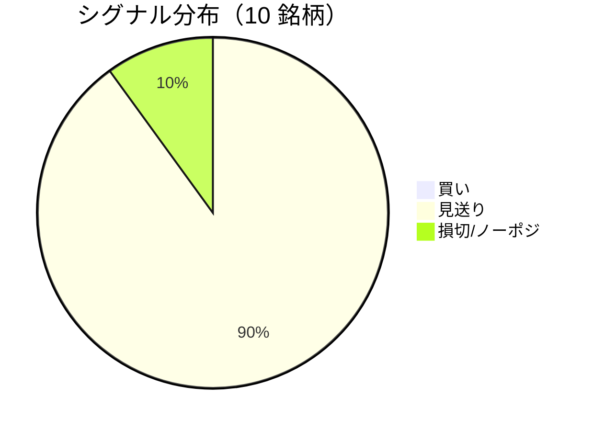

LightGBM + トリプルバリア法による自動取引エージェントの日次ログです。
本記事は GitHub 連携により stock-app から自動生成されています。

:::message alert
**運用モード: モック** — モック環境でのシグナル・シミュレーション結果です。投資判断の参考情報であり、売買推奨ではありません。
:::

## 本日のサマリー

- 処理成功: **10** 銘柄 / 失敗: **0** 銘柄
- 🟢 買い: **0** / ⚪ 見送り: **9** / 🔴 損切・ノーポジ: **1**

## マーケット環境（2026-06-29 時点・5日リターン）

| 指標 | 5日リターン |
| --- | ---: |
| USD/JPY | +0.22% |
| 日経平均 | -3.99% |
| S&P 500 | -0.43% |

## 銘柄別シグナル

| 銘柄 | ティッカー | シグナル | 終値(円) | 利確確率 | 勝率 | PF | 最大DD | リターン |
| --- | --- | --- | ---: | ---: | ---: | ---: | ---: | ---: |
| 日本たばこ産業（JT） | `2914.T` | ⚪ 見送り | 6,026 | 4.7% | 63.6% | 2.71 | -8.3% | +13.55% |
| 武田薬品工業 | `4502.T` | ⚪ 見送り | 5,176 | 7.1% | 56.2% | 1.21 | -10.1% | +5.67% |
| 日立製作所 | `6501.T` | ⚪ 見送り | 4,486 | 35.8% | 47.0% | 1.32 | -23.1% | +59.16% |
| ソニーグループ | `6758.T` | ⚪ 見送り | 3,299 | 24.2% | 36.4% | 0.86 | -30.1% | -8.44% |
| トヨタ自動車 | `7203.T` | 🔴 ノーポジション | 2,772 | 20.5% | 40.7% | 0.77 | -31.4% | -16.57% |
| 本田技研工業 | `7267.T` | ⚪ 見送り | 1,476 | 19.3% | 37.5% | 0.85 | -27.0% | -8.90% |
| 三菱商事 | `8058.T` | ⚪ 見送り | 4,414 | 21.2% | 28.0% | 0.57 | -34.5% | -34.45% |
| 三菱UFJフィナンシャル | `8306.T` | ⚪ 見送り | 3,211 | 21.7% | 51.0% | 1.36 | -10.9% | +28.82% |
| 三井住友フィナンシャルグループ | `8316.T` | ⚪ 見送り | 6,344 | 20.9% | 50.0% | 1.23 | -25.0% | +20.26% |
| 日本電信電話（NTT） | `9432.T` | ⚪ 見送り | 146 | 4.7% | 33.3% | 1.17 | -5.3% | +0.80% |

## パフォーマンスランキング（バックテスト）

### 上位 3 銘柄

| 銘柄 | ティッカー | リターン | 勝率 | PF |
| --- | --- | ---: | ---: | ---: |
| 🥇 日立製作所 | `6501.T` | +59.16% | 47.0% | 1.32 |
| 🥈 三菱UFJフィナンシャル | `8306.T` | +28.82% | 51.0% | 1.36 |
| 🥉 三井住友フィナンシャルグループ | `8316.T` | +20.26% | 50.0% | 1.23 |

### 下位 3 銘柄

| 銘柄 | ティッカー | リターン | 勝率 | PF |
| --- | --- | ---: | ---: | ---: |
| 📉 三菱商事 | `8058.T` | -34.45% | 28.0% | 0.57 |
| 📉 トヨタ自動車 | `7203.T` | -16.57% | 40.7% | 0.77 |
| 📉 本田技研工業 | `7267.T` | -8.90% | 37.5% | 0.85 |

## 買いシグナル詳細

🟢 本日の買いシグナルはありません。

## バックテスト平均（10 銘柄）

| 指標 | 値 |
| --- | ---: |
| 平均勝率 | 44.4% |
| 平均 PF | 1.20 |
| 平均リターン | +5.99% |
| 平均最大 DD | -20.6% |
| 平均シャープ | 0.12 |

## 実取引実績（SQLite）

まだ実取引の記録がありません。

## モデル概要

- **手法**: LightGBM ウォークフォワード + トリプルバリア法（3値分類）
- **特徴量**: テクニカル（SMA/RSI/MACD/ボリンジャー等）+ マクロ（USD/JPY, 日経, S&P500）
- **データリーク**: 全特徴量にラグ処理済み（未来情報なし）
- **買い判定**: 利確クラス確率 > 損切クラス確率 かつ 閾値超え

---

*このシリーズの過去ログをまとめた有料版は Zenn Books で公開予定です。*
