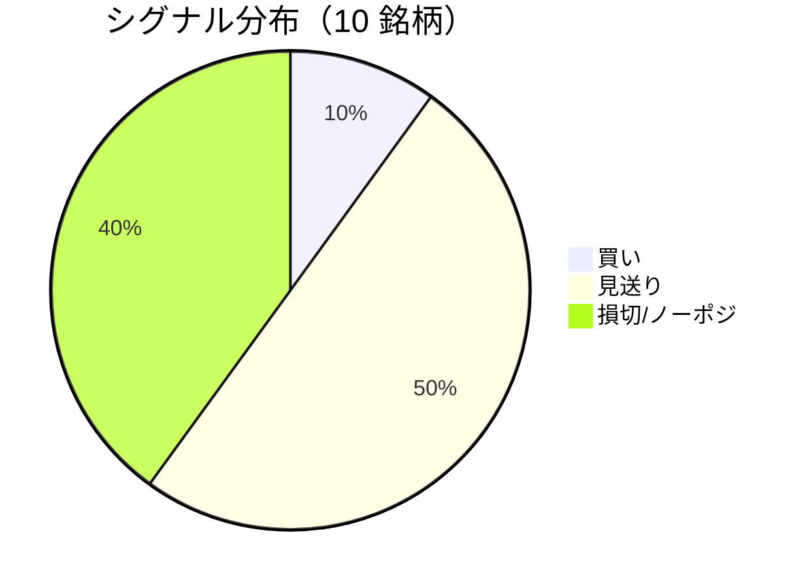

LightGBM + トリプルバリア法による自動取引エージェントの日次ログです。
本記事は GitHub 連携により stock-app から自動生成されています。

:::message alert
**運用モード: デモ** — デモ環境でのシグナル・シミュレーション結果です。投資判断の参考情報であり、売買推奨ではありません。
:::

## 本日のサマリー

- 処理成功: **10** 銘柄 / 失敗: **0** 銘柄
- 🟢 買い: **1** / ⚪ 見送り: **5** / 🔴 損切・ノーポジ: **4**

## マーケット環境（2026-07-17 時点・5日リターン）

| 指標 | 5日リターン |
| --- | ---: |
| USD/JPY | +0.01% |
| 日経平均 | -6.44% |
| S&P 500 | -1.55% |

## 銘柄別シグナル

| 銘柄 | ティッカー | シグナル | 終値(円) | 利確確率 | 勝率 | PF | 最大DD | リターン |
| --- | --- | --- | ---: | ---: | ---: | ---: | ---: | ---: |
| 第一三共 | `4568.T` | 🔴 ノーポジション | 2,791 | 23.5% | 51.0% | 0.91 | -28.7% | -8.70% |
| 日立製作所 | `6501.T` | ⚪ 見送り | 4,717 | 8.1% | 64.3% | 2.87 | -16.8% | +106.85% |
| 富士通 | `6702.T` | ⚪ 見送り | 3,298 | 7.9% | 30.8% | 0.77 | -15.9% | -9.68% |
| ルネサスエレクトロニクス | `6723.T` | 🔴 ノーポジション | 3,822 | 29.0% | 45.9% | 1.47 | -20.0% | +91.14% |
| ソニーグループ | `6758.T` | 🔴 ノーポジション | 3,470 | 14.3% | 26.1% | 0.61 | -16.7% | -11.60% |
| 三菱重工業 | `7011.T` | 🟢 買い | 3,681 | 46.4% | 39.8% | 0.94 | -45.5% | -6.96% |
| 本田技研工業 | `7267.T` | ⚪ 見送り | 1,536 | 4.5% | 40.0% | 1.80 | -5.1% | +5.86% |
| SUBARU | `7270.T` | ⚪ 見送り | 2,534 | 10.3% | 50.0% | 1.82 | -20.8% | +18.56% |
| イオン | `8267.T` | ⚪ 見送り | 1,395 | 2.5% | 16.7% | 0.12 | -11.0% | -7.01% |
| 三菱UFJフィナンシャル | `8306.T` | 🔴 ノーポジション | 3,473 | 9.4% | 40.0% | 1.39 | -5.3% | +2.91% |

## パフォーマンスランキング（バックテスト）

### 上位 3 銘柄

| 銘柄 | ティッカー | リターン | 勝率 | PF |
| --- | --- | ---: | ---: | ---: |
| 🥇 日立製作所 | `6501.T` | +106.85% | 64.3% | 2.87 |
| 🥈 ルネサスエレクトロニクス | `6723.T` | +91.14% | 45.9% | 1.47 |
| 🥉 SUBARU | `7270.T` | +18.56% | 50.0% | 1.82 |

### 下位 3 銘柄

| 銘柄 | ティッカー | リターン | 勝率 | PF |
| --- | --- | ---: | ---: | ---: |
| 📉 ソニーグループ | `6758.T` | -11.60% | 26.1% | 0.61 |
| 📉 富士通 | `6702.T` | -9.68% | 30.8% | 0.77 |
| 📉 第一三共 | `4568.T` | -8.70% | 51.0% | 0.91 |

## 買いシグナル詳細

:::details 三菱重工業（`7011.T`）— 買いシグナル
**予測日**: 2026-07-17

| 項目 | 値 |
| --- | --- |
| 終値 | 3,681 円 |
| 🟢 利確確率 | 46.35% |
| 🔴 損切確率 | 38.26% |
| ⚪ タイムアウト確率 | 15.38% |

**指値提案**（予算 300,000 円 / pt=4.56% / sl=-2.58% / horizon=9日）

| 種別 | 価格 | 株数 |
| --- | ---: | ---: |
| 指値（買い） | 3,849 円 | 0 株 |
| 逆指値（損切） | 3,586 円 | — |

**直近シミュレーション取引（最大3件）**

- 2026-07-07 00:00:00 → 2026-07-08 00:00:00: 4,053 → 3,946 円 (損切) | 損益 -29,128 円
- 2026-07-09 00:00:00 → 2026-07-13 00:00:00: 3,809 → 3,709 円 (損切) | 損益 -28,306 円
- 2026-07-16 00:00:00 → 2026-07-17 00:00:00: 3,835 → 3,734 円 (損切) | 損益 -27,506 円
:::

## バックテスト平均（10 銘柄）

| 指標 | 値 |
| --- | ---: |
| 平均勝率 | 40.5% |
| 平均 PF | 1.27 |
| 平均リターン | +18.14% |
| 平均最大 DD | -18.6% |
| 平均シャープ | 0.17 |

## 実取引実績（SQLite）

まだ実取引の記録がありません。

## Live 予測の答え合わせ

:::message
採点済みシグナルはまだありません。日次パイプライン実行後、各シグナルは **predict_horizon 日（3〜10営業日）** 経過後に自動採点されます。
:::

## モデル概要

- **手法**: LightGBM ウォークフォワード + トリプルバリア法（3値分類）
- **特徴量**: テクニカル（SMA/RSI/MACD/ボリンジャー等）+ マクロ（USD/JPY, 日経, S&P500）
- **データリーク**: 全特徴量にラグ処理済み（未来情報なし）
- **買い判定**: 利確クラス確率 > 損切クラス確率 かつ 閾値超え

---

*このシリーズの過去ログをまとめた有料版は Zenn Books で公開予定です。*
