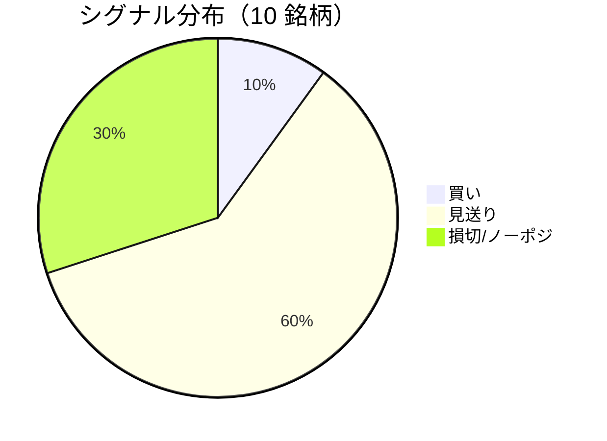

LightGBM + トリプルバリア法による自動取引エージェントの日次ログです。
本記事は GitHub 連携により stock-app から自動生成されています。

:::message alert
**運用モード: デモ** — デモ環境でのシグナル・シミュレーション結果です。投資判断の参考情報であり、売買推奨ではありません。
:::

## 本日のサマリー

- 処理成功: **10** 銘柄 / 失敗: **0** 銘柄
- 🟢 買い: **1** / ⚪ 見送り: **6** / 🔴 損切・ノーポジ: **3**

## マーケット環境（2026-07-20 時点・5日リターン）

| 指標 | 5日リターン |
| --- | ---: |
| USD/JPY | +0.39% |
| 日経平均 | -4.61% |
| S&P 500 | -0.96% |

## 銘柄別シグナル

| 銘柄 | ティッカー | シグナル | 終値(円) | 利確確率 | 勝率 | PF | 最大DD | リターン |
| --- | --- | --- | ---: | ---: | ---: | ---: | ---: | ---: |
| 第一三共 | `4568.T` | ⚪ 見送り | 2,791 | 26.2% | 48.1% | 0.80 | -36.6% | -21.70% |
| 日立製作所 | `6501.T` | 🔴 ノーポジション | 4,717 | 10.3% | 62.1% | 2.71 | -16.8% | +97.12% |
| 富士通 | `6702.T` | ⚪ 見送り | 3,298 | 8.1% | 34.6% | 0.85 | -14.5% | -5.07% |
| ルネサスエレクトロニクス | `6723.T` | 🔴 ノーポジション | 3,822 | 30.3% | 44.8% | 1.43 | -20.8% | +72.04% |
| ソニーグループ | `6758.T` | 🔴 ノーポジション | 3,470 | 17.3% | 31.6% | 0.66 | -12.0% | -7.75% |
| 三菱重工業 | `7011.T` | 🟢 買い | 3,681 | 46.9% | 40.3% | 0.93 | -45.0% | -12.02% |
| 本田技研工業 | `7267.T` | ⚪ 見送り | 1,536 | 4.3% | 40.0% | 1.36 | -7.6% | +4.97% |
| SUBARU | `7270.T` | ⚪ 見送り | 2,534 | 10.4% | 45.5% | 1.10 | -20.8% | +3.03% |
| イオン | `8267.T` | ⚪ 見送り | 1,395 | 4.4% | 16.7% | 0.37 | -11.0% | -5.01% |
| 三菱UFJフィナンシャル | `8306.T` | ⚪ 見送り | 3,473 | 8.4% | 33.3% | 0.28 | -5.8% | -2.64% |

## パフォーマンスランキング（バックテスト）

### 上位 3 銘柄

| 銘柄 | ティッカー | リターン | 勝率 | PF |
| --- | --- | ---: | ---: | ---: |
| 🥇 日立製作所 | `6501.T` | +97.12% | 62.1% | 2.71 |
| 🥈 ルネサスエレクトロニクス | `6723.T` | +72.04% | 44.8% | 1.43 |
| 🥉 本田技研工業 | `7267.T` | +4.97% | 40.0% | 1.36 |

### 下位 3 銘柄

| 銘柄 | ティッカー | リターン | 勝率 | PF |
| --- | --- | ---: | ---: | ---: |
| 📉 第一三共 | `4568.T` | -21.70% | 48.1% | 0.80 |
| 📉 三菱重工業 | `7011.T` | -12.02% | 40.3% | 0.93 |
| 📉 ソニーグループ | `6758.T` | -7.75% | 31.6% | 0.66 |

## 買いシグナル詳細

:::details 三菱重工業（`7011.T`）— 買いシグナル
**予測日**: 2026-07-20

| 項目 | 値 |
| --- | --- |
| 終値 | 3,681 円 |
| 🟢 利確確率 | 46.90% |
| 🔴 損切確率 | 37.61% |
| ⚪ タイムアウト確率 | 15.48% |

**指値提案**（予算 300,000 円 / pt=4.56% / sl=-2.58% / horizon=9日）

| 種別 | 価格 | 株数 |
| --- | ---: | ---: |
| 指値（買い） | 3,849 円 | 0 株 |
| 逆指値（損切） | 3,586 円 | — |

**直近シミュレーション取引（最大3件）**

- 2026-07-07 00:00:00 → 2026-07-08 00:00:00: 4,053 → 3,946 円 (損切) | 損益 -28,102 円
- 2026-07-09 00:00:00 → 2026-07-13 00:00:00: 3,809 → 3,709 円 (損切) | 損益 -27,309 円
- 2026-07-16 00:00:00 → 2026-07-17 00:00:00: 3,835 → 3,734 円 (損切) | 損益 -26,538 円
:::

## バックテスト平均（10 銘柄）

| 指標 | 値 |
| --- | ---: |
| 平均勝率 | 39.7% |
| 平均 PF | 1.05 |
| 平均リターン | +12.30% |
| 平均最大 DD | -19.1% |
| 平均シャープ | 0.09 |

## 実取引実績（SQLite）

まだ実取引の記録がありません。

## Live 予測の答え合わせ

:::message
採点済みシグナルはまだありません。日次パイプライン実行後、各シグナルは **predict_horizon 日（3〜10営業日）** 経過後に自動採点されます。
:::

## モデル概要

- **手法**: LightGBM ウォークフォワード + トリプルバリア法（3値分類）
- **特徴量**: テクニカル（SMA/RSI/MACD/ボリンジャー等）+ マクロ（USD/JPY, 日経, S&P500）
- **データリーク**: 全特徴量にラグ処理済み（未来情報なし）
- **買い判定**: 利確クラス確率 > 損切クラス確率 かつ 閾値超え

---

*このシリーズの過去ログをまとめた有料版は Zenn Books で公開予定です。*
