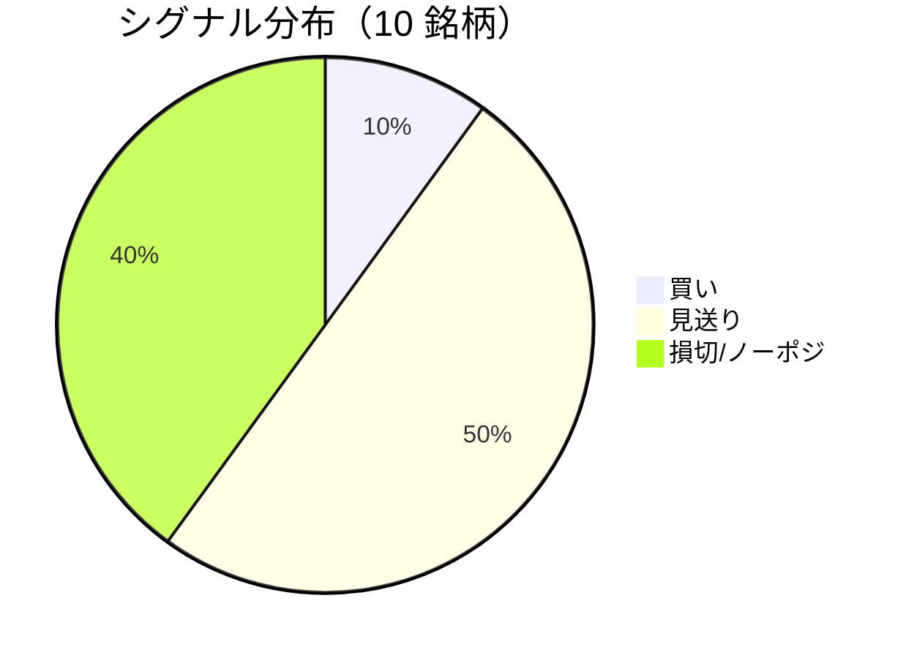

LightGBM + トリプルバリア法による自動取引エージェントの日次ログです。
本記事は GitHub 連携により stock-app から自動生成されています。

:::message alert
**運用モード: デモ** — デモ環境でのシグナル・シミュレーション結果です。投資判断の参考情報であり、売買推奨ではありません。
:::

## 本日のサマリー

- 処理成功: **10** 銘柄 / 失敗: **0** 銘柄
- 🟢 買い: **1** / ⚪ 見送り: **5** / 🔴 損切・ノーポジ: **4**

## マーケット環境（2026-07-21 時点・5日リターン）

| 指標 | 5日リターン |
| --- | ---: |
| USD/JPY | +0.04% |
| 日経平均 | -2.23% |
| S&P 500 | -0.46% |

## 銘柄別シグナル

| 銘柄 | ティッカー | シグナル | 終値(円) | 利確確率 | 勝率 | PF | 最大DD | リターン |
| --- | --- | --- | ---: | ---: | ---: | ---: | ---: | ---: |
| 第一三共 | `4568.T` | 🔴 ノーポジション | 2,815 | 23.3% | 46.2% | 0.80 | -32.9% | -22.04% |
| 日立製作所 | `6501.T` | 🔴 ノーポジション | 4,792 | 10.6% | 67.9% | 4.06 | -16.8% | +126.16% |
| 富士通 | `6702.T` | ⚪ 見送り | 3,309 | 7.6% | 30.4% | 0.78 | -14.6% | -7.57% |
| ルネサスエレクトロニクス | `6723.T` | 🔴 ノーポジション | 4,035 | 37.2% | 48.0% | 1.59 | -20.8% | +108.99% |
| ソニーグループ | `6758.T` | 🔴 ノーポジション | 3,458 | 16.1% | 25.0% | 0.58 | -12.7% | -11.18% |
| 三菱重工業 | `7011.T` | 🟢 買い | 3,852 | 47.0% | 41.5% | 1.00 | -42.6% | +9.92% |
| 本田技研工業 | `7267.T` | ⚪ 見送り | 1,557 | 3.6% | 50.0% | 1.22 | -8.6% | +3.74% |
| SUBARU | `7270.T` | ⚪ 見送り | 2,591 | 10.1% | 40.0% | 1.15 | -22.2% | +3.48% |
| イオン | `8267.T` | ⚪ 見送り | 1,366 | 6.5% | 16.7% | 0.19 | -11.0% | -6.50% |
| 三菱UFJフィナンシャル | `8306.T` | ⚪ 見送り | 3,580 | 7.7% | 50.0% | 2.00 | -5.8% | +7.11% |

## パフォーマンスランキング（バックテスト）

### 上位 3 銘柄

| 銘柄 | ティッカー | リターン | 勝率 | PF |
| --- | --- | ---: | ---: | ---: |
| 🥇 日立製作所 | `6501.T` | +126.16% | 67.9% | 4.06 |
| 🥈 ルネサスエレクトロニクス | `6723.T` | +108.99% | 48.0% | 1.59 |
| 🥉 三菱重工業 | `7011.T` | +9.92% | 41.5% | 1.00 |

### 下位 3 銘柄

| 銘柄 | ティッカー | リターン | 勝率 | PF |
| --- | --- | ---: | ---: | ---: |
| 📉 第一三共 | `4568.T` | -22.04% | 46.2% | 0.80 |
| 📉 ソニーグループ | `6758.T` | -11.18% | 25.0% | 0.58 |
| 📉 富士通 | `6702.T` | -7.57% | 30.4% | 0.78 |

## 買いシグナル詳細

:::details 三菱重工業（`7011.T`）— 買いシグナル
**予測日**: 2026-07-21

| 項目 | 値 |
| --- | --- |
| 終値 | 3,852 円 |
| 🟢 利確確率 | 47.03% |
| 🔴 損切確率 | 37.90% |
| ⚪ タイムアウト確率 | 15.07% |

**指値提案**（予算 300,000 円 / pt=4.56% / sl=-2.58% / horizon=9日）

| 種別 | 価格 | 株数 |
| --- | ---: | ---: |
| 指値（買い） | 4,028 円 | 0 株 |
| 逆指値（損切） | 3,753 円 | — |

**直近シミュレーション取引（最大3件）**

- 2026-07-07 00:00:00 → 2026-07-08 00:00:00: 4,053 → 3,946 円 (損切) | 損益 -33,554 円
- 2026-07-09 00:00:00 → 2026-07-13 00:00:00: 3,809 → 3,709 円 (損切) | 損益 -32,607 円
- 2026-07-16 00:00:00 → 2026-07-17 00:00:00: 3,835 → 3,734 円 (損切) | 損益 -31,686 円
:::

## バックテスト平均（10 銘柄）

| 指標 | 値 |
| --- | ---: |
| 平均勝率 | 41.6% |
| 平均 PF | 1.34 |
| 平均リターン | +21.21% |
| 平均最大 DD | -18.8% |
| 平均シャープ | 0.18 |

## 実取引実績（SQLite）

まだ実取引の記録がありません。

## Live 予測の答え合わせ（直近 30 日）

:::message
バックテストとは別に、**毎日の live シグナル**を SQLite に記録し、エントリー（翌営業日始値）から **predict_horizon 日**後にトリプルバリア outcome を採点しています。
:::

| 指標 | 値 |
| --- | ---: |
| 採点済みシグナル | 5 件 |
| 全体一致率 | 40.0% |
| 買いシグナル一致率 | 100.0%（1 件） |
| 買いシグナル平均リターン（反実仮想） | +4.56% |

### シグナル別一致率

| シグナル | 件数 | 採点済 | 一致率 |
| --- | ---: | ---: | ---: |
| 🟢 買い | 1 | 1 | 100.0% |
| ⚪ 見送り | 2 | 2 | 0.0% |
| 🔴 ノーポジション | 2 | 2 | 50.0% |

### 直近の採点結果

- ✅ **2026-07-21** ルネサスエレクトロニクス: 予測=🔴 ノーポジション → 実際=損切 (StopLoss, -3.10%)
- ❌ **2026-07-20** 富士通: 予測=⚪ 見送り → 実際=損切 (StopLoss, -2.56%)
- ❌ **2026-07-20** ルネサスエレクトロニクス: 予測=🔴 ノーポジション → 実際=利確 (TakeProfit, +6.61%)
- ✅ **2026-07-20** 三菱重工業: 予測=🟢 買い → 実際=利確 (TakeProfit, +4.56%)
- ❌ **2026-07-20** イオン: 予測=⚪ 見送り → 実際=損切 (StopLoss, -4.31%)

## モデル概要

- **手法**: LightGBM ウォークフォワード + トリプルバリア法（3値分類）
- **特徴量**: テクニカル（SMA/RSI/MACD/ボリンジャー等）+ マクロ（USD/JPY, 日経, S&P500）
- **データリーク**: 全特徴量にラグ処理済み（未来情報なし）
- **買い判定**: 利確クラス確率 > 損切クラス確率 かつ 閾値超え

---

*このシリーズの過去ログをまとめた有料版は Zenn Books で公開予定です。*
