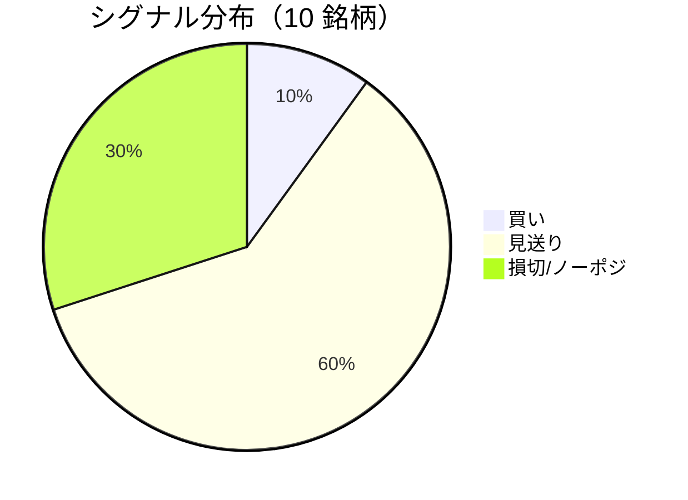

LightGBM + トリプルバリア法による自動取引エージェントの日次ログです。
本記事は GitHub 連携により stock-app から自動生成されています。

:::message alert
**運用モード: デモ** — デモ環境でのシグナル・シミュレーション結果です。投資判断の参考情報であり、売買推奨ではありません。
:::

## 本日のサマリー

- 処理成功: **10** 銘柄 / 失敗: **0** 銘柄
- 🟢 買い: **1** / ⚪ 見送り: **6** / 🔴 損切・ノーポジ: **3**

## マーケット環境（2026-07-22 時点・5日リターン）

| 指標 | 5日リターン |
| --- | ---: |
| USD/JPY | +0.62% |
| 日経平均 | -3.83% |
| S&P 500 | -0.97% |

## 銘柄別シグナル

| 銘柄 | ティッカー | シグナル | 終値(円) | 利確確率 | 勝率 | PF | 最大DD | リターン |
| --- | --- | --- | ---: | ---: | ---: | ---: | ---: | ---: |
| 第一三共 | `4568.T` | ⚪ 見送り | 2,762 | 26.2% | 42.9% | 0.68 | -46.6% | -37.93% |
| 日立製作所 | `6501.T` | 🔴 ノーポジション | 4,807 | 10.1% | 61.5% | 2.68 | -16.8% | +76.48% |
| 富士通 | `6702.T` | ⚪ 見送り | 3,311 | 8.2% | 24.0% | 0.56 | -21.7% | -17.50% |
| ルネサスエレクトロニクス | `6723.T` | 🔴 ノーポジション | 4,175 | 28.7% | 43.8% | 1.29 | -18.3% | +58.16% |
| ソニーグループ | `6758.T` | 🔴 ノーポジション | 3,444 | 16.4% | 40.7% | 1.12 | -16.0% | +5.51% |
| 三菱重工業 | `7011.T` | 🟢 買い | 3,892 | 47.0% | 40.7% | 0.97 | -45.6% | +3.30% |
| 本田技研工業 | `7267.T` | ⚪ 見送り | 1,559 | 4.3% | 25.0% | 0.63 | -8.6% | -4.97% |
| SUBARU | `7270.T` | ⚪ 見送り | 2,583 | 10.1% | 41.7% | 0.96 | -24.5% | -0.62% |
| イオン | `8267.T` | ⚪ 見送り | 1,358 | 2.2% | 25.0% | 0.45 | -11.0% | -5.28% |
| 三菱UFJフィナンシャル | `8306.T` | ⚪ 見送り | 3,668 | 9.9% | 30.0% | 0.98 | -12.3% | +0.24% |

## パフォーマンスランキング（バックテスト）

### 上位 3 銘柄

| 銘柄 | ティッカー | リターン | 勝率 | PF |
| --- | --- | ---: | ---: | ---: |
| 🥇 日立製作所 | `6501.T` | +76.48% | 61.5% | 2.68 |
| 🥈 ルネサスエレクトロニクス | `6723.T` | +58.16% | 43.8% | 1.29 |
| 🥉 ソニーグループ | `6758.T` | +5.51% | 40.7% | 1.12 |

### 下位 3 銘柄

| 銘柄 | ティッカー | リターン | 勝率 | PF |
| --- | --- | ---: | ---: | ---: |
| 📉 第一三共 | `4568.T` | -37.93% | 42.9% | 0.68 |
| 📉 富士通 | `6702.T` | -17.50% | 24.0% | 0.56 |
| 📉 イオン | `8267.T` | -5.28% | 25.0% | 0.45 |

## 買いシグナル詳細

:::details 三菱重工業（`7011.T`）— 買いシグナル
**予測日**: 2026-07-22

| 項目 | 値 |
| --- | --- |
| 終値 | 3,892 円 |
| 🟢 利確確率 | 47.02% |
| 🔴 損切確率 | 37.48% |
| ⚪ タイムアウト確率 | 15.50% |

**指値提案**（予算 300,000 円 / pt=4.56% / sl=-2.58% / horizon=9日）

| 種別 | 価格 | 株数 |
| --- | ---: | ---: |
| 指値（買い） | 4,069 円 | 0 株 |
| 逆指値（損切） | 3,792 円 | — |

**直近シミュレーション取引（最大3件）**

- 2026-07-07 00:00:00 → 2026-07-08 00:00:00: 4,053 → 3,946 円 (損切) | 損益 -31,209 円
- 2026-07-09 00:00:00 → 2026-07-13 00:00:00: 3,809 → 3,709 円 (損切) | 損益 -30,328 円
- 2026-07-14 00:00:00 → 2026-07-17 00:00:00: 3,799 → 3,699 円 (損切) | 損益 -29,472 円
:::

## バックテスト平均（10 銘柄）

| 指標 | 値 |
| --- | ---: |
| 平均勝率 | 37.5% |
| 平均 PF | 1.03 |
| 平均リターン | +7.74% |
| 平均最大 DD | -22.1% |
| 平均シャープ | 0.06 |

## 実取引実績（SQLite）

まだ実取引の記録がありません。

## Live 予測の答え合わせ（直近 30 日）

:::message
バックテストとは別に、**毎日の live シグナル**を SQLite に記録し、エントリー（翌営業日始値）から **predict_horizon 日**後にトリプルバリア outcome を採点しています。
:::

| 指標 | 値 |
| --- | ---: |
| 採点済みシグナル | 6 件 |
| 全体一致率 | 50.0% |
| 買いシグナル一致率 | 100.0%（1 件） |
| 買いシグナル平均リターン（反実仮想） | +4.56% |

### シグナル別一致率

| シグナル | 件数 | 採点済 | 一致率 |
| --- | ---: | ---: | ---: |
| 🟢 買い | 1 | 1 | 100.0% |
| ⚪ 見送り | 2 | 2 | 0.0% |
| 🔴 ノーポジション | 3 | 3 | 66.7% |

### 直近の採点結果

- ✅ **2026-07-22** ルネサスエレクトロニクス: 予測=🔴 ノーポジション → 実際=損切 (StopLoss, -3.10%)
- ✅ **2026-07-21** ルネサスエレクトロニクス: 予測=🔴 ノーポジション → 実際=損切 (StopLoss, -3.10%)
- ❌ **2026-07-20** 富士通: 予測=⚪ 見送り → 実際=損切 (StopLoss, -2.56%)
- ❌ **2026-07-20** ルネサスエレクトロニクス: 予測=🔴 ノーポジション → 実際=利確 (TakeProfit, +6.61%)
- ✅ **2026-07-20** 三菱重工業: 予測=🟢 買い → 実際=利確 (TakeProfit, +4.56%)

## モデル概要

- **手法**: LightGBM ウォークフォワード + トリプルバリア法（3値分類）
- **特徴量**: テクニカル（SMA/RSI/MACD/ボリンジャー等）+ マクロ（USD/JPY, 日経, S&P500）
- **データリーク**: 全特徴量にラグ処理済み（未来情報なし）
- **買い判定**: 利確クラス確率 > 損切クラス確率 かつ 閾値超え

---

*このシリーズの過去ログをまとめた有料版は Zenn Books で公開予定です。*
