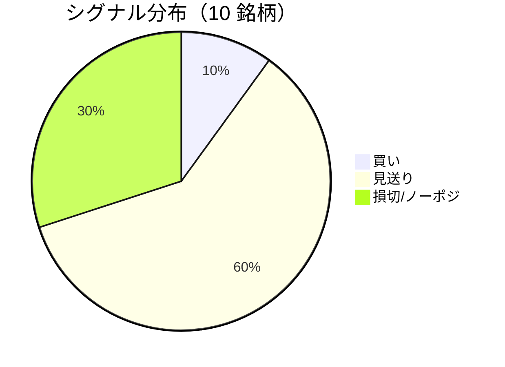

LightGBM + トリプルバリア法による自動取引エージェントの日次ログです。
本記事は GitHub 連携により stock-app から自動生成されています。

:::message alert
**運用モード: デモ** — デモ環境でのシグナル・シミュレーション結果です。投資判断の参考情報であり、売買推奨ではありません。
:::

## 本日のサマリー

- 処理成功: **10** 銘柄 / 失敗: **0** 銘柄
- 🟢 買い: **1** / ⚪ 見送り: **6** / 🔴 損切・ノーポジ: **3**

## マーケット環境（2026-07-23 時点・5日リターン）

| 指標 | 5日リターン |
| --- | ---: |
| USD/JPY | +0.62% |
| 日経平均 | -0.62% |
| S&P 500 | -1.67% |

## 銘柄別シグナル

| 銘柄 | ティッカー | シグナル | 終値(円) | 利確確率 | 勝率 | PF | 最大DD | リターン |
| --- | --- | --- | ---: | ---: | ---: | ---: | ---: | ---: |
| 第一三共 | `4568.T` | ⚪ 見送り | 2,755 | 26.2% | 45.1% | 0.69 | -43.1% | -34.49% |
| 日立製作所 | `6501.T` | 🔴 ノーポジション | 4,854 | 10.5% | 64.0% | 3.49 | -16.8% | +96.15% |
| 富士通 | `6702.T` | ⚪ 見送り | 3,244 | 4.3% | 26.9% | 0.62 | -19.7% | -15.34% |
| ルネサスエレクトロニクス | `6723.T` | 🔴 ノーポジション | 4,199 | 32.4% | 41.9% | 1.20 | -26.8% | +38.95% |
| ソニーグループ | `6758.T` | 🔴 ノーポジション | 3,445 | 16.9% | 40.0% | 1.15 | -12.5% | +5.94% |
| 三菱重工業 | `7011.T` | 🟢 買い | 3,930 | 47.2% | 41.3% | 0.99 | -42.4% | +5.56% |
| 本田技研工業 | `7267.T` | ⚪ 見送り | 1,566 | 4.4% | 25.0% | 0.63 | -8.6% | -4.97% |
| SUBARU | `7270.T` | ⚪ 見送り | 2,612 | 9.9% | 50.0% | 1.00 | -24.5% | +0.46% |
| イオン | `8267.T` | ⚪ 見送り | 1,333 | 1.0% | 12.5% | 0.30 | -11.0% | -6.93% |
| 三菱UFJフィナンシャル | `8306.T` | ⚪ 見送り | 3,750 | 10.0% | 40.0% | 1.19 | -12.3% | +3.07% |

## パフォーマンスランキング（バックテスト）

### 上位 3 銘柄

| 銘柄 | ティッカー | リターン | 勝率 | PF |
| --- | --- | ---: | ---: | ---: |
| 🥇 日立製作所 | `6501.T` | +96.15% | 64.0% | 3.49 |
| 🥈 ルネサスエレクトロニクス | `6723.T` | +38.95% | 41.9% | 1.20 |
| 🥉 ソニーグループ | `6758.T` | +5.94% | 40.0% | 1.15 |

### 下位 3 銘柄

| 銘柄 | ティッカー | リターン | 勝率 | PF |
| --- | --- | ---: | ---: | ---: |
| 📉 第一三共 | `4568.T` | -34.49% | 45.1% | 0.69 |
| 📉 富士通 | `6702.T` | -15.34% | 26.9% | 0.62 |
| 📉 イオン | `8267.T` | -6.93% | 12.5% | 0.30 |

## 買いシグナル詳細

:::details 三菱重工業（`7011.T`）— 買いシグナル
**予測日**: 2026-07-23

| 項目 | 値 |
| --- | --- |
| 終値 | 3,930 円 |
| 🟢 利確確率 | 47.16% |
| 🔴 損切確率 | 37.37% |
| ⚪ タイムアウト確率 | 15.47% |

**指値提案**（予算 300,000 円 / pt=4.56% / sl=-2.58% / horizon=9日）

| 種別 | 価格 | 株数 |
| --- | ---: | ---: |
| 指値（買い） | 4,109 円 | 0 株 |
| 逆指値（損切） | 3,829 円 | — |

**直近シミュレーション取引（最大3件）**

- 2026-07-09 00:00:00 → 2026-07-13 00:00:00: 3,809 → 3,709 円 (損切) | 損益 -30,792 円
- 2026-07-14 00:00:00 → 2026-07-17 00:00:00: 3,799 → 3,699 円 (損切) | 損益 -29,922 円
- 2026-07-20 00:00:00 → 2026-07-23 00:00:00: 3,752 → 3,921 円 (利確) | 損益 +43,009 円
:::

## バックテスト平均（10 銘柄）

| 指標 | 値 |
| --- | ---: |
| 平均勝率 | 38.7% |
| 平均 PF | 1.13 |
| 平均リターン | +8.84% |
| 平均最大 DD | -21.8% |
| 平均シャープ | 0.08 |

## 実取引実績（SQLite）

まだ実取引の記録がありません。

## Live 予測の答え合わせ（直近 30 日）

:::message
バックテストとは別に、**毎日の live シグナル**を SQLite に記録し、エントリー（翌営業日始値）から **predict_horizon 日**後にトリプルバリア outcome を採点しています。
:::

| 指標 | 値 |
| --- | ---: |
| 採点済みシグナル | 10 件 |
| 全体一致率 | 70.0% |
| 買いシグナル一致率 | 100.0%（2 件） |
| 買いシグナル平均リターン（反実仮想） | +4.56% |

### シグナル別一致率

| シグナル | 件数 | 採点済 | 一致率 |
| --- | ---: | ---: | ---: |
| 🟢 買い | 2 | 2 | 100.0% |
| ⚪ 見送り | 2 | 2 | 0.0% |
| 🔴 ノーポジション | 6 | 6 | 83.3% |

### 直近の採点結果

- ✅ **2026-07-23** ルネサスエレクトロニクス: 予測=🔴 ノーポジション → 実際=損切 (StopLoss, -3.10%)
- ✅ **2026-07-22** ルネサスエレクトロニクス: 予測=🔴 ノーポジション → 実際=損切 (StopLoss, -3.10%)
- ✅ **2026-07-22** ソニーグループ: 予測=🔴 ノーポジション → 実際=損切 (StopLoss, -2.04%)
- ✅ **2026-07-21** ルネサスエレクトロニクス: 予測=🔴 ノーポジション → 実際=損切 (StopLoss, -3.10%)
- ✅ **2026-07-21** 三菱重工業: 予測=🟢 買い → 実際=利確 (TakeProfit, +4.56%)

## モデル概要

- **手法**: LightGBM ウォークフォワード + トリプルバリア法（3値分類）
- **特徴量**: テクニカル（SMA/RSI/MACD/ボリンジャー等）+ マクロ（USD/JPY, 日経, S&P500）
- **データリーク**: 全特徴量にラグ処理済み（未来情報なし）
- **買い判定**: 利確クラス確率 > 損切クラス確率 かつ 閾値超え

---

*このシリーズの過去ログをまとめた有料版は Zenn Books で公開予定です。*
