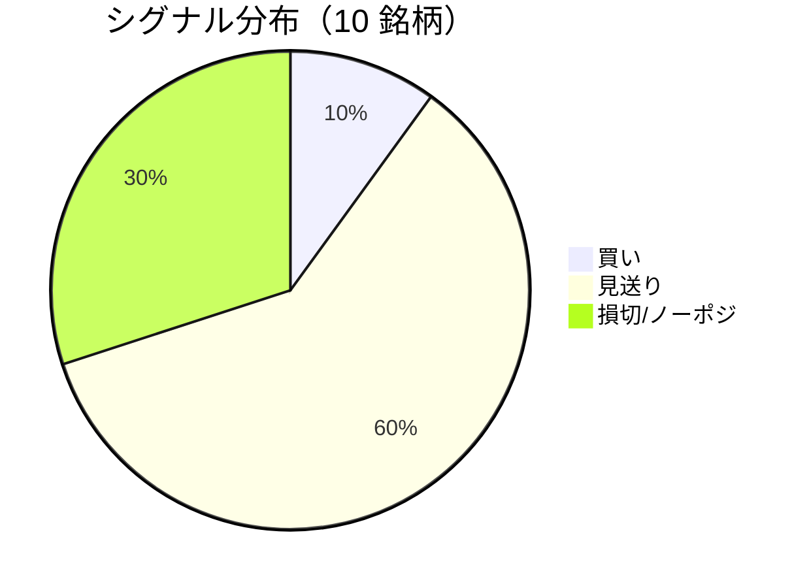

LightGBM + トリプルバリア法による自動取引エージェントの日次ログです。
本記事は GitHub 連携により stock-app から自動生成されています。

:::message alert
**運用モード: デモ** — デモ環境でのシグナル・シミュレーション結果です。投資判断の参考情報であり、売買推奨ではありません。
:::

## 本日のサマリー

- 処理成功: **10** 銘柄 / 失敗: **0** 銘柄
- 🟢 買い: **1** / ⚪ 見送り: **6** / 🔴 損切・ノーポジ: **3**

## マーケット環境（2026-07-24 時点・5日リターン）

| 指標 | 5日リターン |
| --- | ---: |
| USD/JPY | +0.90% |
| 日経平均 | +0.73% |
| S&P 500 | -0.61% |

## 銘柄別シグナル

| 銘柄 | ティッカー | シグナル | 終値(円) | 利確確率 | 勝率 | PF | 最大DD | リターン |
| --- | --- | --- | ---: | ---: | ---: | ---: | ---: | ---: |
| 第一三共 | `4568.T` | ⚪ 見送り | 2,800 | 26.7% | 43.1% | 0.73 | -51.2% | -31.89% |
| 日立製作所 | `6501.T` | 🔴 ノーポジション | 4,850 | 9.6% | 57.1% | 2.01 | -16.8% | +52.04% |
| 富士通 | `6702.T` | ⚪ 見送り | 3,279 | 6.9% | 32.0% | 0.73 | -21.2% | -10.45% |
| ルネサスエレクトロニクス | `6723.T` | 🔴 ノーポジション | 3,928 | 37.5% | 43.8% | 1.30 | -23.3% | +49.66% |
| ソニーグループ | `6758.T` | 🔴 ノーポジション | 3,409 | 17.3% | 33.3% | 0.81 | -19.1% | -6.88% |
| 三菱重工業 | `7011.T` | 🟢 買い | 3,945 | 46.4% | 42.2% | 1.00 | -33.6% | +7.06% |
| 本田技研工業 | `7267.T` | ⚪ 見送り | 1,536 | 4.1% | 25.0% | 0.63 | -8.6% | -4.97% |
| SUBARU | `7270.T` | ⚪ 見送り | 2,557 | 9.6% | 50.0% | 1.75 | -20.8% | +18.56% |
| イオン | `8267.T` | ⚪ 見送り | 1,339 | 1.3% | 0.0% | 0.00 | -11.0% | -7.99% |
| 三菱UFJフィナンシャル | `8306.T` | ⚪ 見送り | 3,754 | 9.3% | 42.9% | 0.97 | -7.9% | +0.10% |

## パフォーマンスランキング（バックテスト）

### 上位 3 銘柄

| 銘柄 | ティッカー | リターン | 勝率 | PF |
| --- | --- | ---: | ---: | ---: |
| 🥇 日立製作所 | `6501.T` | +52.04% | 57.1% | 2.01 |
| 🥈 ルネサスエレクトロニクス | `6723.T` | +49.66% | 43.8% | 1.30 |
| 🥉 SUBARU | `7270.T` | +18.56% | 50.0% | 1.75 |

### 下位 3 銘柄

| 銘柄 | ティッカー | リターン | 勝率 | PF |
| --- | --- | ---: | ---: | ---: |
| 📉 第一三共 | `4568.T` | -31.89% | 43.1% | 0.73 |
| 📉 富士通 | `6702.T` | -10.45% | 32.0% | 0.73 |
| 📉 イオン | `8267.T` | -7.99% | 0.0% | 0.00 |

## 買いシグナル詳細

:::details 三菱重工業（`7011.T`）— 買いシグナル
**予測日**: 2026-07-24

| 項目 | 値 |
| --- | --- |
| 終値 | 3,945 円 |
| 🟢 利確確率 | 46.45% |
| 🔴 損切確率 | 38.36% |
| ⚪ タイムアウト確率 | 15.20% |

**指値提案**（予算 300,000 円 / pt=4.56% / sl=-2.58% / horizon=9日）

| 種別 | 価格 | 株数 |
| --- | ---: | ---: |
| 指値（買い） | 4,125 円 | 0 株 |
| 逆指値（損切） | 3,843 円 | — |

**直近シミュレーション取引（最大3件）**

- 2026-07-07 00:00:00 → 2026-07-08 00:00:00: 4,053 → 3,946 円 (損切) | 損益 -31,524 円
- 2026-07-13 00:00:00 → 2026-07-17 00:00:00: 3,812 → 3,712 円 (損切) | 損益 -30,634 円
- 2026-07-20 00:00:00 → 2026-07-23 00:00:00: 3,752 → 3,921 円 (利確) | 損益 +44,031 円
:::

## バックテスト平均（10 銘柄）

| 指標 | 値 |
| --- | ---: |
| 平均勝率 | 36.9% |
| 平均 PF | 0.99 |
| 平均リターン | +6.52% |
| 平均最大 DD | -21.3% |
| 平均シャープ | 0.05 |

## 実取引実績（SQLite）

まだ実取引の記録がありません。

## Live 予測の答え合わせ（直近 30 日）

:::message
バックテストとは別に、**毎日の live シグナル**を SQLite に記録し、エントリー（翌営業日始値）から **predict_horizon 日**後にトリプルバリア outcome を採点しています。
:::

| 指標 | 値 |
| --- | ---: |
| 採点済みシグナル | 16 件 |
| 全体一致率 | 50.0% |
| 買いシグナル一致率 | 100.0%（2 件） |
| 買いシグナル平均リターン（反実仮想） | +4.56% |

### シグナル別一致率

| シグナル | 件数 | 採点済 | 一致率 |
| --- | ---: | ---: | ---: |
| 🟢 買い | 2 | 2 | 100.0% |
| ⚪ 見送り | 5 | 5 | 0.0% |
| 🔴 ノーポジション | 9 | 9 | 66.7% |

### 直近の採点結果

- ✅ **2026-07-24** ルネサスエレクトロニクス: 予測=🔴 ノーポジション → 実際=損切 (StopLoss, -3.10%)
- ❌ **2026-07-23** 富士通: 予測=⚪ 見送り → 実際=利確 (TakeProfit, +5.67%)
- ✅ **2026-07-23** ルネサスエレクトロニクス: 予測=🔴 ノーポジション → 実際=損切 (StopLoss, -3.10%)
- ❌ **2026-07-23** ソニーグループ: 予測=🔴 ノーポジション → 実際=利確 (TakeProfit, +4.96%)
- ❌ **2026-07-22** 富士通: 予測=⚪ 見送り → 実際=利確 (TakeProfit, +5.67%)

## モデル概要

- **手法**: LightGBM ウォークフォワード + トリプルバリア法（3値分類）
- **特徴量**: テクニカル（SMA/RSI/MACD/ボリンジャー等）+ マクロ（USD/JPY, 日経, S&P500）
- **データリーク**: 全特徴量にラグ処理済み（未来情報なし）
- **買い判定**: 利確クラス確率 > 損切クラス確率 かつ 閾値超え

---

*このシリーズの過去ログをまとめた有料版は Zenn Books で公開予定です。*
