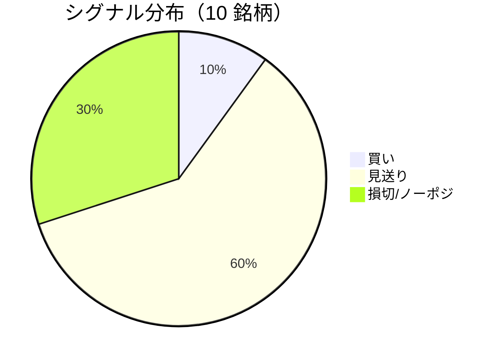

LightGBM + トリプルバリア法による自動取引エージェントの日次ログです。
本記事は GitHub 連携により stock-app から自動生成されています。

:::message alert
**運用モード: デモ** — デモ環境でのシグナル・シミュレーション結果です。投資判断の参考情報であり、売買推奨ではありません。
:::

## 本日のサマリー

- 処理成功: **10** 銘柄 / 失敗: **0** 銘柄
- 🟢 買い: **1** / ⚪ 見送り: **6** / 🔴 損切・ノーポジ: **3**

## マーケット環境（2026-07-28 時点・5日リターン）

| 指標 | 5日リターン |
| --- | ---: |
| USD/JPY | +0.79% |
| 日経平均 | -5.84% |
| S&P 500 | -1.07% |

## 銘柄別シグナル

| 銘柄 | ティッカー | シグナル | 終値(円) | 利確確率 | 勝率 | PF | 最大DD | リターン |
| --- | --- | --- | ---: | ---: | ---: | ---: | ---: | ---: |
| 第一三共 | `4568.T` | ⚪ 見送り | 2,890 | 26.8% | 46.2% | 0.82 | -40.7% | -16.53% |
| 日立製作所 | `6501.T` | ⚪ 見送り | 4,890 | 11.3% | 65.6% | 3.36 | -20.0% | +129.95% |
| 富士通 | `6702.T` | ⚪ 見送り | 3,700 | 5.8% | 42.3% | 1.22 | -10.0% | +10.98% |
| ルネサスエレクトロニクス | `6723.T` | 🔴 ノーポジション | 3,462 | 25.5% | 48.4% | 1.50 | -16.5% | +84.76% |
| ソニーグループ | `6758.T` | 🔴 ノーポジション | 3,662 | 17.4% | 34.3% | 0.94 | -17.2% | -1.22% |
| 三菱重工業 | `7011.T` | 🟢 買い | 3,805 | 46.9% | 39.7% | 0.94 | -34.5% | -8.81% |
| 本田技研工業 | `7267.T` | ⚪ 見送り | 1,612 | 3.3% | 25.0% | 0.63 | -8.6% | -4.97% |
| SUBARU | `7270.T` | ⚪ 見送り | 2,680 | 9.7% | 60.0% | 2.83 | -10.5% | +27.53% |
| イオン | `8267.T` | ⚪ 見送り | 1,420 | 3.3% | 0.0% | 0.00 | -11.0% | -9.72% |
| 三菱UFJフィナンシャル | `8306.T` | 🔴 ノーポジション | 3,661 | 10.9% | 50.0% | 1.51 | -7.9% | +8.61% |

## パフォーマンスランキング（バックテスト）

### 上位 3 銘柄

| 銘柄 | ティッカー | リターン | 勝率 | PF |
| --- | --- | ---: | ---: | ---: |
| 🥇 日立製作所 | `6501.T` | +129.95% | 65.6% | 3.36 |
| 🥈 ルネサスエレクトロニクス | `6723.T` | +84.76% | 48.4% | 1.50 |
| 🥉 SUBARU | `7270.T` | +27.53% | 60.0% | 2.83 |

### 下位 3 銘柄

| 銘柄 | ティッカー | リターン | 勝率 | PF |
| --- | --- | ---: | ---: | ---: |
| 📉 第一三共 | `4568.T` | -16.53% | 46.2% | 0.82 |
| 📉 イオン | `8267.T` | -9.72% | 0.0% | 0.00 |
| 📉 三菱重工業 | `7011.T` | -8.81% | 39.7% | 0.94 |

## 買いシグナル詳細

:::details 三菱重工業（`7011.T`）— 買いシグナル
**予測日**: 2026-07-28

| 項目 | 値 |
| --- | --- |
| 終値 | 3,805 円 |
| 🟢 利確確率 | 46.94% |
| 🔴 損切確率 | 37.88% |
| ⚪ タイムアウト確率 | 15.18% |

**指値提案**（予算 300,000 円 / pt=4.56% / sl=-2.58% / horizon=9日）

| 種別 | 価格 | 株数 |
| --- | ---: | ---: |
| 指値（買い） | 3,979 円 | 0 株 |
| 逆指値（損切） | 3,707 円 | — |

**直近シミュレーション取引（最大3件）**

- 2026-07-13 00:00:00 → 2026-07-17 00:00:00: 3,812 → 3,712 円 (損切) | 損益 -26,684 円
- 2026-07-20 00:00:00 → 2026-07-23 00:00:00: 3,752 → 3,921 円 (利確) | 損益 +38,353 円
- 2026-07-24 00:00:00 → 2026-07-27 00:00:00: 3,978 → 3,873 円 (損切) | 損益 -27,045 円
:::

## バックテスト平均（10 銘柄）

| 指標 | 値 |
| --- | ---: |
| 平均勝率 | 41.1% |
| 平均 PF | 1.37 |
| 平均リターン | +22.06% |
| 平均最大 DD | -17.7% |
| 平均シャープ | 0.22 |

## 実取引実績（SQLite）

まだ実取引の記録がありません。

## Live 予測の答え合わせ（直近 30 日）

:::message
バックテストとは別に、**毎日の live シグナル**を SQLite に記録し、エントリー（翌営業日始値）から **predict_horizon 日**後にトリプルバリア outcome を採点しています。
:::

| 指標 | 値 |
| --- | ---: |
| 採点済みシグナル | 39 件 |
| 全体一致率 | 28.2% |
| 買いシグナル一致率 | 33.3%（6 件） |
| 買いシグナル平均リターン（反実仮想） | -0.20% |

### シグナル別一致率

| シグナル | 件数 | 採点済 | 一致率 |
| --- | ---: | ---: | ---: |
| 🟢 買い | 6 | 6 | 33.3% |
| ⚪ 見送り | 20 | 20 | 5.0% |
| 🔴 ノーポジション | 13 | 13 | 61.5% |

### 直近の採点結果

- ❌ **2026-07-28** 富士通: 予測=⚪ 見送り → 実際=損切 (StopLoss, -2.56%)
- ✅ **2026-07-28** ルネサスエレクトロニクス: 予測=🔴 ノーポジション → 実際=損切 (StopLoss, -3.10%)
- ❌ **2026-07-28** 三菱UFJフィナンシャル: 予測=⚪ 見送り → 実際=損切 (StopLoss, -2.19%)
- ❌ **2026-07-27** 富士通: 予測=⚪ 見送り → 実際=利確 (TakeProfit, +5.67%)
- ✅ **2026-07-27** ルネサスエレクトロニクス: 予測=🔴 ノーポジション → 実際=損切 (StopLoss, -3.10%)

## モデル概要

- **手法**: LightGBM ウォークフォワード + トリプルバリア法（3値分類）
- **特徴量**: テクニカル（SMA/RSI/MACD/ボリンジャー等）+ マクロ（USD/JPY, 日経, S&P500）
- **データリーク**: 全特徴量にラグ処理済み（未来情報なし）
- **買い判定**: 利確クラス確率 > 損切クラス確率 かつ 閾値超え

---

*このシリーズの過去ログをまとめた有料版は Zenn Books で公開予定です。*
