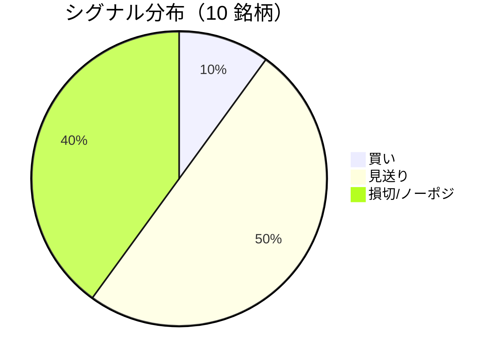

LightGBM + トリプルバリア法による自動取引エージェントの日次ログです。
本記事は GitHub 連携により stock-app から自動生成されています。

:::message alert
**運用モード: デモ** — デモ環境でのシグナル・シミュレーション結果です。投資判断の参考情報であり、売買推奨ではありません。
:::

## 本日のサマリー

- 処理成功: **10** 銘柄 / 失敗: **0** 銘柄
- 🟢 買い: **1** / ⚪ 見送り: **5** / 🔴 損切・ノーポジ: **4**

## マーケット環境（2026-07-29 時点・5日リターン）

| 指標 | 5日リターン |
| --- | ---: |
| USD/JPY | +0.42% |
| 日経平均 | -7.08% |
| S&P 500 | -2.44% |

## 銘柄別シグナル

| 銘柄 | ティッカー | シグナル | 終値(円) | 利確確率 | 勝率 | PF | 最大DD | リターン |
| --- | --- | --- | ---: | ---: | ---: | ---: | ---: | ---: |
| 第一三共 | `4568.T` | ⚪ 見送り | 2,886 | 26.9% | 48.1% | 0.83 | -35.3% | -15.62% |
| 日立製作所 | `6501.T` | 🔴 ノーポジション | 4,957 | 10.8% | 66.7% | 3.27 | -9.9% | +130.62% |
| 富士通 | `6702.T` | ⚪ 見送り | 3,844 | 7.0% | 39.1% | 1.09 | -16.8% | +4.34% |
| ルネサスエレクトロニクス | `6723.T` | 🔴 ノーポジション | 3,170 | 26.9% | 47.1% | 1.47 | -18.8% | +72.29% |
| ソニーグループ | `6758.T` | 🔴 ノーポジション | 3,809 | 17.3% | 34.3% | 0.95 | -17.9% | -0.90% |
| 三菱重工業 | `7011.T` | 🟢 買い | 3,740 | 47.1% | 39.1% | 0.92 | -44.0% | -13.77% |
| 本田技研工業 | `7267.T` | ⚪ 見送り | 1,688 | 4.3% | 33.3% | 1.57 | -4.9% | +3.34% |
| SUBARU | `7270.T` | ⚪ 見送り | 2,848 | 9.7% | 50.0% | 1.56 | -20.8% | +10.81% |
| イオン | `8267.T` | ⚪ 見送り | 1,440 | 7.1% | 0.0% | 0.00 | -11.0% | -7.99% |
| 三菱UFJフィナンシャル | `8306.T` | 🔴 ノーポジション | 3,647 | 13.0% | 44.4% | 1.66 | -7.9% | +7.92% |

## パフォーマンスランキング（バックテスト）

### 上位 3 銘柄

| 銘柄 | ティッカー | リターン | 勝率 | PF |
| --- | --- | ---: | ---: | ---: |
| 🥇 日立製作所 | `6501.T` | +130.62% | 66.7% | 3.27 |
| 🥈 ルネサスエレクトロニクス | `6723.T` | +72.29% | 47.1% | 1.47 |
| 🥉 SUBARU | `7270.T` | +10.81% | 50.0% | 1.56 |

### 下位 3 銘柄

| 銘柄 | ティッカー | リターン | 勝率 | PF |
| --- | --- | ---: | ---: | ---: |
| 📉 第一三共 | `4568.T` | -15.62% | 48.1% | 0.83 |
| 📉 三菱重工業 | `7011.T` | -13.77% | 39.1% | 0.92 |
| 📉 イオン | `8267.T` | -7.99% | 0.0% | 0.00 |

## 買いシグナル詳細

:::details 三菱重工業（`7011.T`）— 買いシグナル
**予測日**: 2026-07-29

| 項目 | 値 |
| --- | --- |
| 終値 | 3,740 円 |
| 🟢 利確確率 | 47.08% |
| 🔴 損切確率 | 38.16% |
| ⚪ タイムアウト確率 | 14.76% |

**指値提案**（予算 300,000 円 / pt=4.56% / sl=-2.58% / horizon=9日）

| 種別 | 価格 | 株数 |
| --- | ---: | ---: |
| 指値（買い） | 3,911 円 | 0 株 |
| 逆指値（損切） | 3,644 円 | — |

**直近シミュレーション取引（最大3件）**

- 2026-07-20 00:00:00 → 2026-07-23 00:00:00: 3,752 → 3,921 円 (利確) | 損益 +37,206 円
- 2026-07-24 00:00:00 → 2026-07-27 00:00:00: 3,978 → 3,873 円 (損切) | 損益 -26,236 円
- 2026-07-28 00:00:00 → 2026-07-29 00:00:00: 3,813 → 3,713 円 (損切) | 損益 -25,496 円
:::

## バックテスト平均（10 銘柄）

| 指標 | 値 |
| --- | ---: |
| 平均勝率 | 40.2% |
| 平均 PF | 1.33 |
| 平均リターン | +19.10% |
| 平均最大 DD | -18.7% |
| 平均シャープ | 0.21 |

## 実取引実績（SQLite）

まだ実取引の記録がありません。

## Live 予測の答え合わせ（直近 30 日）

:::message
バックテストとは別に、**毎日の live シグナル**を SQLite に記録し、エントリー（翌営業日始値）から **predict_horizon 日**後にトリプルバリア outcome を採点しています。
:::

| 指標 | 値 |
| --- | ---: |
| 採点済みシグナル | 52 件 |
| 全体一致率 | 23.1% |
| 買いシグナル一致率 | 33.3%（6 件） |
| 買いシグナル平均リターン（反実仮想） | -0.20% |

### シグナル別一致率

| シグナル | 件数 | 採点済 | 一致率 |
| --- | ---: | ---: | ---: |
| 🟢 買い | 6 | 6 | 33.3% |
| ⚪ 見送り | 27 | 27 | 3.7% |
| 🔴 ノーポジション | 19 | 19 | 47.4% |

### 直近の採点結果

- ❌ **2026-07-29** 日立製作所: 予測=⚪ 見送り → 実際=損切 (StopLoss, -3.66%)
- ❌ **2026-07-29** 富士通: 予測=⚪ 見送り → 実際=損切 (StopLoss, -2.56%)
- ❌ **2026-07-29** ルネサスエレクトロニクス: 予測=🔴 ノーポジション → 実際=利確 (TakeProfit, +6.61%)
- ✅ **2026-07-29** ソニーグループ: 予測=🔴 ノーポジション → 実際=損切 (StopLoss, -2.04%)
- ❌ **2026-07-28** 富士通: 予測=⚪ 見送り → 実際=損切 (StopLoss, -2.56%)

## モデル概要

- **手法**: LightGBM ウォークフォワード + トリプルバリア法（3値分類）
- **特徴量**: テクニカル（SMA/RSI/MACD/ボリンジャー等）+ マクロ（USD/JPY, 日経, S&P500）
- **データリーク**: 全特徴量にラグ処理済み（未来情報なし）
- **買い判定**: 利確クラス確率 > 損切クラス確率 かつ 閾値超え

---

*このシリーズの過去ログをまとめた有料版は Zenn Books で公開予定です。*
