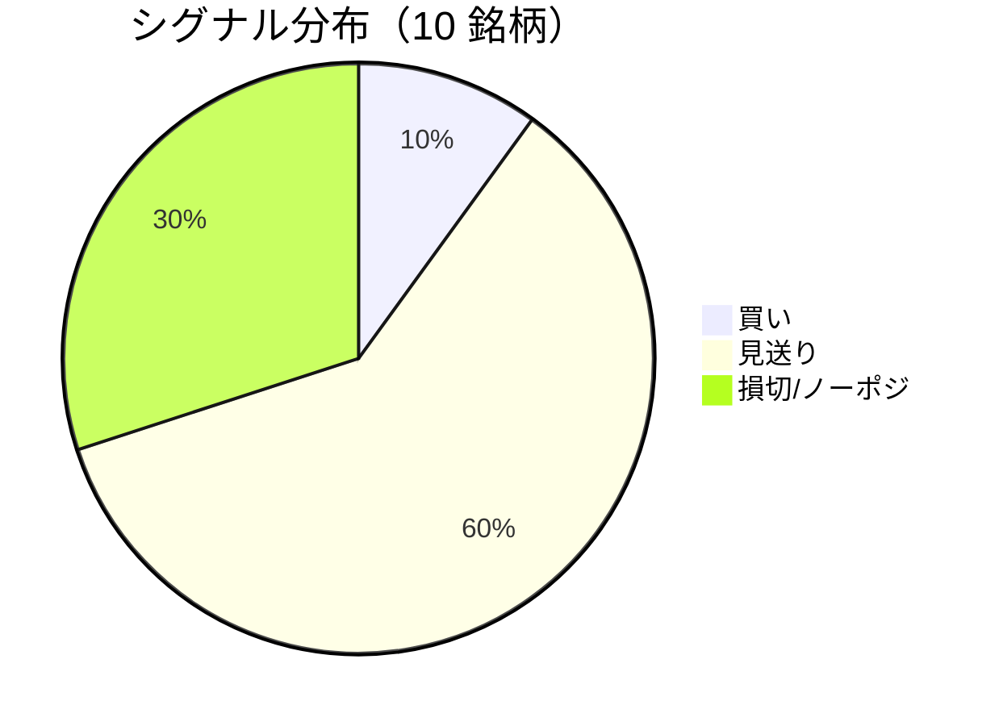

LightGBM + トリプルバリア法による自動取引エージェントの日次ログです。
本記事は GitHub 連携により stock-app から自動生成されています。

:::message alert
**運用モード: デモ** — デモ環境でのシグナル・シミュレーション結果です。投資判断の参考情報であり、売買推奨ではありません。
:::

## 本日のサマリー

- 処理成功: **10** 銘柄 / 失敗: **0** 銘柄
- 🟢 買い: **1** / ⚪ 見送り: **6** / 🔴 損切・ノーポジ: **3**

## マーケット環境（2026-07-30 時点・5日リターン）

| 指標 | 5日リターン |
| --- | ---: |
| USD/JPY | +0.13% |
| 日経平均 | -6.86% |
| S&P 500 | +0.40% |

## 銘柄別シグナル

| 銘柄 | ティッカー | シグナル | 終値(円) | 利確確率 | 勝率 | PF | 最大DD | リターン |
| --- | --- | --- | ---: | ---: | ---: | ---: | ---: | ---: |
| 第一三共 | `4568.T` | ⚪ 見送り | 2,889 | 26.8% | 47.1% | 0.82 | -36.1% | -16.58% |
| 日立製作所 | `6501.T` | 🔴 ノーポジション | 5,255 | 11.3% | 64.5% | 2.93 | -13.4% | +105.22% |
| 富士通 | `6702.T` | ⚪ 見送り | 3,902 | 6.6% | 34.8% | 0.96 | -16.8% | -0.15% |
| ルネサスエレクトロニクス | `6723.T` | 🔴 ノーポジション | 3,196 | 33.9% | 46.5% | 1.42 | -18.8% | +78.46% |
| ソニーグループ | `6758.T` | 🔴 ノーポジション | 3,809 | 17.4% | 34.2% | 0.89 | -17.9% | -4.41% |
| 三菱重工業 | `7011.T` | 🟢 買い | 3,736 | 47.4% | 39.1% | 0.90 | -45.4% | -18.26% |
| 本田技研工業 | `7267.T` | ⚪ 見送り | 1,670 | 3.9% | 50.0% | 1.80 | -4.9% | +4.74% |
| SUBARU | `7270.T` | ⚪ 見送り | 2,823 | 9.6% | 36.4% | 0.95 | -24.5% | -0.77% |
| イオン | `8267.T` | ⚪ 見送り | 1,423 | 15.4% | 0.0% | 0.00 | -11.0% | -7.99% |
| 三菱UFJフィナンシャル | `8306.T` | ⚪ 見送り | 3,525 | 9.3% | 55.6% | 2.48 | -7.9% | +12.34% |

## パフォーマンスランキング（バックテスト）

### 上位 3 銘柄

| 銘柄 | ティッカー | リターン | 勝率 | PF |
| --- | --- | ---: | ---: | ---: |
| 🥇 日立製作所 | `6501.T` | +105.22% | 64.5% | 2.93 |
| 🥈 ルネサスエレクトロニクス | `6723.T` | +78.46% | 46.5% | 1.42 |
| 🥉 三菱UFJフィナンシャル | `8306.T` | +12.34% | 55.6% | 2.48 |

### 下位 3 銘柄

| 銘柄 | ティッカー | リターン | 勝率 | PF |
| --- | --- | ---: | ---: | ---: |
| 📉 三菱重工業 | `7011.T` | -18.26% | 39.1% | 0.90 |
| 📉 第一三共 | `4568.T` | -16.58% | 47.1% | 0.82 |
| 📉 イオン | `8267.T` | -7.99% | 0.0% | 0.00 |

## 買いシグナル詳細

:::details 三菱重工業（`7011.T`）— 買いシグナル
**予測日**: 2026-07-30

| 項目 | 値 |
| --- | --- |
| 終値 | 3,736 円 |
| 🟢 利確確率 | 47.43% |
| 🔴 損切確率 | 37.58% |
| ⚪ タイムアウト確率 | 14.98% |

**指値提案**（予算 300,000 円 / pt=4.56% / sl=-2.58% / horizon=9日）

| 種別 | 価格 | 株数 |
| --- | ---: | ---: |
| 指値（買い） | 3,906 円 | 0 株 |
| 逆指値（損切） | 3,640 円 | — |

**直近シミュレーション取引（最大3件）**

- 2026-07-20 00:00:00 → 2026-07-23 00:00:00: 3,752 → 3,921 円 (利確) | 損益 +35,076 円
- 2026-07-24 00:00:00 → 2026-07-27 00:00:00: 3,978 → 3,873 円 (損切) | 損益 -24,734 円
- 2026-07-28 00:00:00 → 2026-07-29 00:00:00: 3,813 → 3,713 円 (損切) | 損益 -24,036 円
:::

## バックテスト平均（10 銘柄）

| 指標 | 値 |
| --- | ---: |
| 平均勝率 | 40.8% |
| 平均 PF | 1.31 |
| 平均リターン | +15.26% |
| 平均最大 DD | -19.7% |
| 平均シャープ | 0.17 |

## 実取引実績（SQLite）

まだ実取引の記録がありません。

## Live 予測の答え合わせ（直近 30 日）

:::message
バックテストとは別に、**毎日の live シグナル**を SQLite に記録し、エントリー（翌営業日始値）から **predict_horizon 日**後にトリプルバリア outcome を採点しています。
:::

| 指標 | 値 |
| --- | ---: |
| 採点済みシグナル | 73 件 |
| 全体一致率 | 21.9% |
| 買いシグナル一致率 | 28.6%（7 件） |
| 買いシグナル平均リターン（反実仮想） | -0.54% |

### シグナル別一致率

| シグナル | 件数 | 採点済 | 一致率 |
| --- | ---: | ---: | ---: |
| 🟢 買い | 7 | 7 | 28.6% |
| ⚪ 見送り | 40 | 40 | 5.0% |
| 🔴 ノーポジション | 26 | 26 | 46.2% |

### 直近の採点結果

- ❌ **2026-07-30** 第一三共: 予測=⚪ 見送り → 実際=損切 (StopLoss, -4.61%)
- ❌ **2026-07-30** 富士通: 予測=⚪ 見送り → 実際=利確 (TakeProfit, +5.67%)
- ✅ **2026-07-30** ルネサスエレクトロニクス: 予測=🔴 ノーポジション → 実際=損切 (StopLoss, -3.10%)
- ❌ **2026-07-30** ソニーグループ: 予測=🔴 ノーポジション → 実際=利確 (TakeProfit, +4.96%)
- ❌ **2026-07-30** 三菱重工業: 予測=🟢 買い → 実際=損切 (StopLoss, -2.58%)

## モデル概要

- **手法**: LightGBM ウォークフォワード + トリプルバリア法（3値分類）
- **特徴量**: テクニカル（SMA/RSI/MACD/ボリンジャー等）+ マクロ（USD/JPY, 日経, S&P500）
- **データリーク**: 全特徴量にラグ処理済み（未来情報なし）
- **買い判定**: 利確クラス確率 > 損切クラス確率 かつ 閾値超え

---

*このシリーズの過去ログをまとめた有料版は Zenn Books で公開予定です。*
