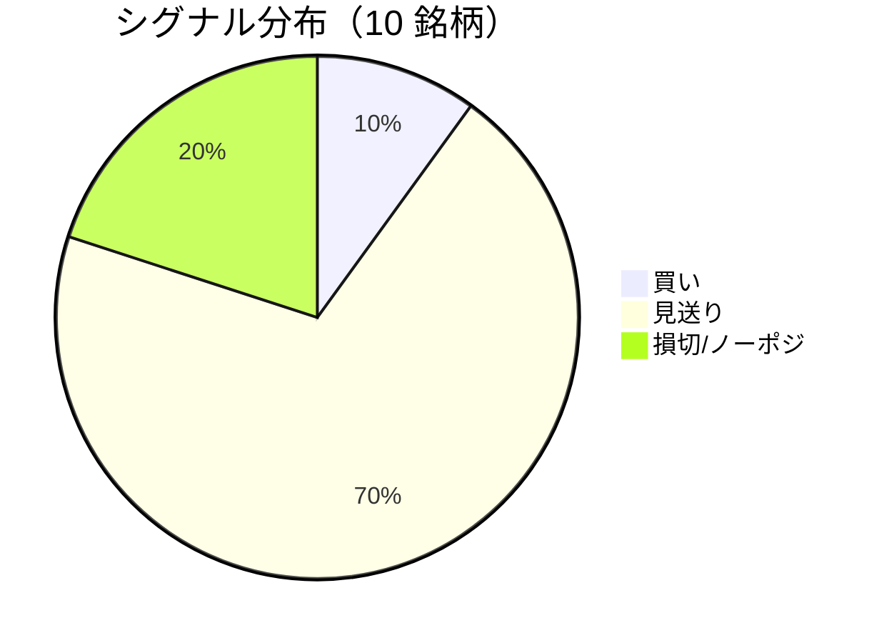

LightGBM + トリプルバリア法による自動取引エージェントの日次ログです。
本記事は GitHub 連携により stock-app から自動生成されています。

:::message alert
**運用モード: デモ** — デモ環境でのシグナル・シミュレーション結果です。投資判断の参考情報であり、売買推奨ではありません。
:::

## 本日のサマリー

- 処理成功: **10** 銘柄 / 失敗: **0** 銘柄
- 🟢 買い: **1** / ⚪ 見送り: **7** / 🔴 損切・ノーポジ: **2**

## マーケット環境（2026-08-03 時点・5日リターン）

| 指標 | 5日リターン |
| --- | ---: |
| USD/JPY | -3.68% |
| 日経平均 | -0.88% |
| S&P 500 | +1.03% |

## 銘柄別シグナル

| 銘柄 | ティッカー | シグナル | 終値(円) | 利確確率 | 勝率 | PF | 最大DD | リターン |
| --- | --- | --- | ---: | ---: | ---: | ---: | ---: | ---: |
| 第一三共 | `4568.T` | ⚪ 見送り | 2,570 | 31.8% | 40.9% | 0.65 | -43.3% | -37.08% |
| 日立製作所 | `6501.T` | ⚪ 見送り | 5,301 | 10.4% | 56.7% | 2.25 | -15.1% | +83.91% |
| 富士通 | `6702.T` | ⚪ 見送り | 3,500 | 11.2% | 36.8% | 0.97 | -15.7% | -0.04% |
| ルネサスエレクトロニクス | `6723.T` | 🔴 ノーポジション | 3,905 | 37.0% | 45.9% | 1.43 | -23.1% | +67.76% |
| ソニーグループ | `6758.T` | 🔴 ノーポジション | 3,589 | 17.9% | 37.2% | 0.98 | -20.0% | +0.97% |
| 三菱重工業 | `7011.T` | 🟢 買い | 3,799 | 47.5% | 44.4% | 1.09 | -38.9% | +41.95% |
| 本田技研工業 | `7267.T` | ⚪ 見送り | 1,567 | 3.8% | 50.0% | 1.67 | -6.4% | +3.99% |
| SUBARU | `7270.T` | ⚪ 見送り | 2,618 | 9.6% | 71.4% | 7.84 | -9.6% | +40.97% |
| イオン | `8267.T` | ⚪ 見送り | 1,366 | 1.0% | 20.0% | 0.82 | -17.8% | -3.01% |
| 三菱UFJフィナンシャル | `8306.T` | ⚪ 見送り | 3,567 | 10.1% | 40.0% | 0.82 | -8.7% | -2.06% |

## パフォーマンスランキング（バックテスト）

### 上位 3 銘柄

| 銘柄 | ティッカー | リターン | 勝率 | PF |
| --- | --- | ---: | ---: | ---: |
| 🥇 日立製作所 | `6501.T` | +83.91% | 56.7% | 2.25 |
| 🥈 ルネサスエレクトロニクス | `6723.T` | +67.76% | 45.9% | 1.43 |
| 🥉 三菱重工業 | `7011.T` | +41.95% | 44.4% | 1.09 |

### 下位 3 銘柄

| 銘柄 | ティッカー | リターン | 勝率 | PF |
| --- | --- | ---: | ---: | ---: |
| 📉 第一三共 | `4568.T` | -37.08% | 40.9% | 0.65 |
| 📉 イオン | `8267.T` | -3.01% | 20.0% | 0.82 |
| 📉 三菱UFJフィナンシャル | `8306.T` | -2.06% | 40.0% | 0.82 |

## 買いシグナル詳細

:::details 三菱重工業（`7011.T`）— 買いシグナル
**予測日**: 2026-08-03

| 項目 | 値 |
| --- | --- |
| 終値 | 3,799 円 |
| 🟢 利確確率 | 47.54% |
| 🔴 損切確率 | 37.67% |
| ⚪ タイムアウト確率 | 14.78% |

**指値提案**（予算 300,000 円 / pt=4.56% / sl=-2.58% / horizon=9日）

| 種別 | 価格 | 株数 |
| --- | ---: | ---: |
| 指値（買い） | 3,972 円 | 0 株 |
| 逆指値（損切） | 3,701 円 | — |

**直近シミュレーション取引（最大3件）**

- 2026-07-08 00:00:00 → 2026-07-09 00:00:00: 3,941 → 3,837 円 (損切) | 損益 -40,497 円
- 2026-07-16 00:00:00 → 2026-07-17 00:00:00: 3,835 → 3,734 円 (損切) | 損益 -39,354 円
- 2026-07-20 00:00:00 → 2026-07-23 00:00:00: 3,752 → 3,921 円 (利確) | 損益 +56,564 円
:::

## バックテスト平均（10 銘柄）

| 指標 | 値 |
| --- | ---: |
| 平均勝率 | 44.3% |
| 平均 PF | 1.85 |
| 平均リターン | +19.74% |
| 平均最大 DD | -19.9% |
| 平均シャープ | 0.23 |

## 実取引実績（SQLite）

まだ実取引の記録がありません。

## Live 予測の答え合わせ（直近 30 日）

:::message
バックテストとは別に、**毎日の live シグナル**を SQLite に記録し、エントリー（翌営業日始値）から **predict_horizon 日**後にトリプルバリア outcome を採点しています。
:::

| 指標 | 値 |
| --- | ---: |
| 採点済みシグナル | 91 件 |
| 全体一致率 | 26.4% |
| 買いシグナル一致率 | 36.4%（11 件） |
| 買いシグナル平均リターン（反実仮想） | +0.02% |

### シグナル別一致率

| シグナル | 件数 | 採点済 | 一致率 |
| --- | ---: | ---: | ---: |
| 🟢 買い | 11 | 11 | 36.4% |
| ⚪ 見送り | 50 | 50 | 8.0% |
| 🔴 ノーポジション | 30 | 30 | 53.3% |

### 直近の採点結果

- ❌ **2026-08-03** 富士通: 予測=⚪ 見送り → 実際=損切 (StopLoss, -2.56%)
- ✅ **2026-08-03** ルネサスエレクトロニクス: 予測=🔴 ノーポジション → 実際=損切 (StopLoss, -3.10%)
- ✅ **2026-08-03** 三菱重工業: 予測=🟢 買い → 実際=利確 (TakeProfit, +4.56%)
- ❌ **2026-07-31** 富士通: 予測=⚪ 見送り → 実際=損切 (StopLoss, -2.56%)
- ✅ **2026-07-31** ルネサスエレクトロニクス: 予測=🔴 ノーポジション → 実際=損切 (StopLoss (Dual Touch), -3.10%)

## モデル概要

- **手法**: LightGBM ウォークフォワード + トリプルバリア法（3値分類）
- **特徴量**: テクニカル（SMA/RSI/MACD/ボリンジャー等）+ マクロ（USD/JPY, 日経, S&P500）
- **データリーク**: 全特徴量にラグ処理済み（未来情報なし）
- **買い判定**: 利確クラス確率 > 損切クラス確率 かつ 閾値超え

---

*このシリーズの過去ログをまとめた有料版は Zenn Books で公開予定です。*
