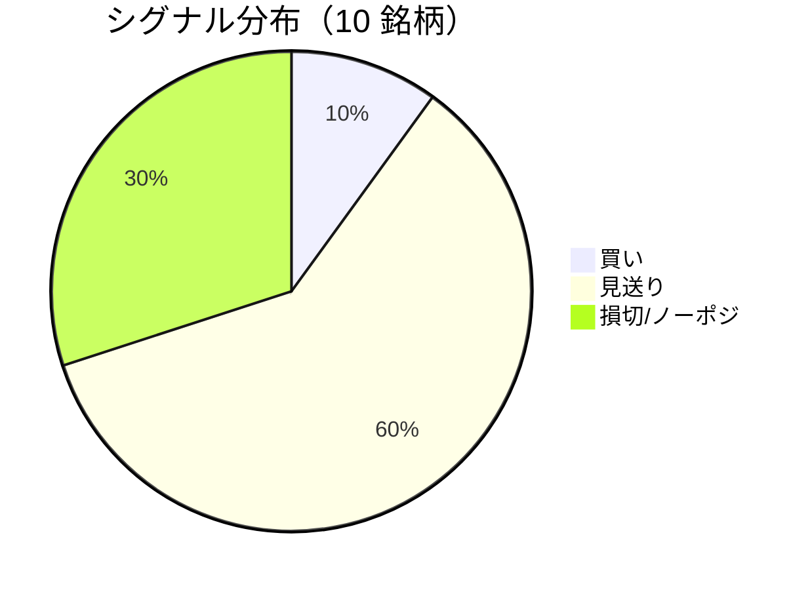

LightGBM + トリプルバリア法による自動取引エージェントの日次ログです。
本記事は GitHub 連携により stock-app から自動生成されています。

:::message alert
**運用モード: デモ** — デモ環境でのシグナル・シミュレーション結果です。投資判断の参考情報であり、売買推奨ではありません。
:::

## 本日のサマリー

- 処理成功: **10** 銘柄 / 失敗: **0** 銘柄
- 🟢 買い: **1** / ⚪ 見送り: **6** / 🔴 損切・ノーポジ: **3**

## マーケット環境（2026-08-05 時点・5日リターン）

| 指標 | 5日リターン |
| --- | ---: |
| USD/JPY | -3.77% |
| 日経平均 | +7.92% |
| S&P 500 | +5.57% |

## 銘柄別シグナル

| 銘柄 | ティッカー | シグナル | 終値(円) | 利確確率 | 勝率 | PF | 最大DD | リターン |
| --- | --- | --- | ---: | ---: | ---: | ---: | ---: | ---: |
| 第一三共 | `4568.T` | ⚪ 見送り | 2,585 | 26.4% | 43.5% | 0.74 | -45.4% | -29.16% |
| 日立製作所 | `6501.T` | 🔴 ノーポジション | 5,476 | 10.8% | 50.0% | 1.98 | -21.6% | +80.73% |
| 富士通 | `6702.T` | ⚪ 見送り | 3,483 | 7.2% | 42.3% | 1.25 | -10.9% | +11.70% |
| ルネサスエレクトロニクス | `6723.T` | 🔴 ノーポジション | 3,813 | 34.4% | 44.7% | 1.40 | -23.1% | +80.56% |
| ソニーグループ | `6758.T` | 🔴 ノーポジション | 3,565 | 15.0% | 34.1% | 0.80 | -22.2% | -9.70% |
| 三菱重工業 | `7011.T` | 🟢 買い | 4,000 | 46.8% | 41.7% | 0.98 | -44.8% | +1.67% |
| 本田技研工業 | `7267.T` | ⚪ 見送り | 1,636 | 3.8% | 50.0% | 2.25 | -4.9% | +7.24% |
| SUBARU | `7270.T` | ⚪ 見送り | 2,476 | 10.0% | 75.0% | 4.18 | -9.6% | +39.50% |
| イオン | `8267.T` | ⚪ 見送り | 1,325 | 0.7% | 20.0% | 0.52 | -16.5% | -8.20% |
| 三菱UFJフィナンシャル | `8306.T` | ⚪ 見送り | 3,541 | 10.0% | 45.0% | 1.79 | -8.8% | +25.11% |

## パフォーマンスランキング（バックテスト）

### 上位 3 銘柄

| 銘柄 | ティッカー | リターン | 勝率 | PF |
| --- | --- | ---: | ---: | ---: |
| 🥇 日立製作所 | `6501.T` | +80.73% | 50.0% | 1.98 |
| 🥈 ルネサスエレクトロニクス | `6723.T` | +80.56% | 44.7% | 1.40 |
| 🥉 SUBARU | `7270.T` | +39.50% | 75.0% | 4.18 |

### 下位 3 銘柄

| 銘柄 | ティッカー | リターン | 勝率 | PF |
| --- | --- | ---: | ---: | ---: |
| 📉 第一三共 | `4568.T` | -29.16% | 43.5% | 0.74 |
| 📉 ソニーグループ | `6758.T` | -9.70% | 34.1% | 0.80 |
| 📉 イオン | `8267.T` | -8.20% | 20.0% | 0.52 |

## 買いシグナル詳細

:::details 三菱重工業（`7011.T`）— 買いシグナル
**予測日**: 2026-08-05

| 項目 | 値 |
| --- | --- |
| 終値 | 4,000 円 |
| 🟢 利確確率 | 46.85% |
| 🔴 損切確率 | 39.18% |
| ⚪ タイムアウト確率 | 13.97% |

**指値提案**（予算 300,000 円 / pt=4.56% / sl=-2.58% / horizon=9日）

| 種別 | 価格 | 株数 |
| --- | ---: | ---: |
| 指値（買い） | 4,182 円 | 0 株 |
| 逆指値（損切） | 3,897 円 | — |

**直近シミュレーション取引（最大3件）**

- 2026-07-16 00:00:00 → 2026-07-17 00:00:00: 3,835 → 3,734 円 (損切) | 損益 -27,631 円
- 2026-07-20 00:00:00 → 2026-07-23 00:00:00: 3,752 → 3,921 円 (利確) | 損益 +39,715 円
- 2026-07-30 00:00:00 → 2026-08-04 00:00:00: 3,712 → 3,879 円 (利確) | 損益 +41,423 円
:::

## バックテスト平均（10 銘柄）

| 指標 | 値 |
| --- | ---: |
| 平均勝率 | 44.6% |
| 平均 PF | 1.59 |
| 平均リターン | +19.94% |
| 平均最大 DD | -20.8% |
| 平均シャープ | 0.25 |

## 実取引実績（SQLite）

まだ実取引の記録がありません。

## Live 予測の答え合わせ（直近 30 日）

:::message
バックテストとは別に、**毎日の live シグナル**を SQLite に記録し、エントリー（翌営業日始値）から **predict_horizon 日**後にトリプルバリア outcome を採点しています。
:::

| 指標 | 値 |
| --- | ---: |
| 採点済みシグナル | 102 件 |
| 全体一致率 | 29.4% |
| 買いシグナル一致率 | 33.3%（12 件） |
| 買いシグナル平均リターン（反実仮想） | -0.20% |

### シグナル別一致率

| シグナル | 件数 | 採点済 | 一致率 |
| --- | ---: | ---: | ---: |
| 🟢 買い | 12 | 12 | 33.3% |
| ⚪ 見送り | 57 | 57 | 12.3% |
| 🔴 ノーポジション | 33 | 33 | 57.6% |

### 直近の採点結果

- ✅ **2026-08-05** ルネサスエレクトロニクス: 予測=🔴 ノーポジション → 実際=損切 (StopLoss, -3.10%)
- ✅ **2026-08-04** ルネサスエレクトロニクス: 予測=🔴 ノーポジション → 実際=損切 (StopLoss, -3.10%)
- ❌ **2026-08-04** 三菱重工業: 予測=🟢 買い → 実際=損切 (StopLoss, -2.58%)
- ❌ **2026-08-04** SUBARU: 予測=⚪ 見送り → 実際=損切 (StopLoss, -4.46%)
- ❌ **2026-08-03** 富士通: 予測=⚪ 見送り → 実際=損切 (StopLoss, -2.56%)

## モデル概要

- **手法**: LightGBM ウォークフォワード + トリプルバリア法（3値分類）
- **特徴量**: テクニカル（SMA/RSI/MACD/ボリンジャー等）+ マクロ（USD/JPY, 日経, S&P500）
- **データリーク**: 全特徴量にラグ処理済み（未来情報なし）
- **買い判定**: 利確クラス確率 > 損切クラス確率 かつ 閾値超え

---

*このシリーズの過去ログをまとめた有料版は Zenn Books で公開予定です。*
