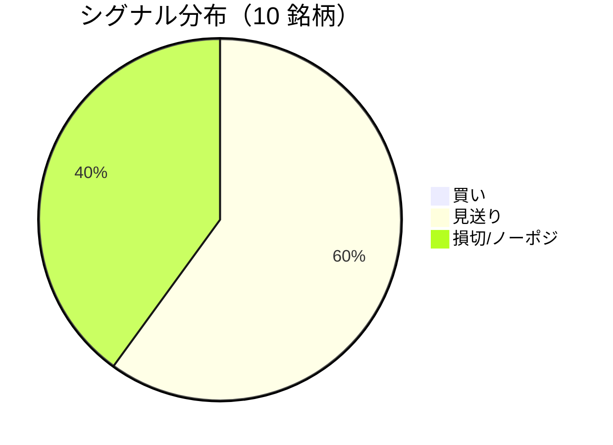

LightGBM + トリプルバリア法による自動取引エージェントの日次ログです。
本記事は GitHub 連携により stock-app から自動生成されています。

:::message alert
**運用モード: デモ** — デモ環境でのシグナル・シミュレーション結果です。投資判断の参考情報であり、売買推奨ではありません。
:::

## 本日のサマリー

- 処理成功: **10** 銘柄 / 失敗: **0** 銘柄
- 🟢 買い: **0** / ⚪ 見送り: **6** / 🔴 損切・ノーポジ: **4**

## マーケット環境（2026-08-10 時点・5日リターン）

| 指標 | 5日リターン |
| --- | ---: |
| USD/JPY | +0.20% |
| 日経平均 | +5.04% |
| S&P 500 | +2.01% |

## 銘柄別シグナル

| 銘柄 | ティッカー | シグナル | 終値(円) | 利確確率 | 勝率 | PF | 最大DD | リターン |
| --- | --- | --- | ---: | ---: | ---: | ---: | ---: | ---: |
| 第一三共 | `4568.T` | ⚪ 見送り | 2,805 | 26.5% | 48.9% | 0.93 | -30.8% | -7.04% |
| 日立製作所 | `6501.T` | ⚪ 見送り | 5,620 | 10.4% | 60.0% | 2.05 | -16.8% | +79.63% |
| 富士通 | `6702.T` | 🔴 ノーポジション | 3,719 | 3.4% | 33.3% | 0.83 | -17.4% | -3.72% |
| ルネサスエレクトロニクス | `6723.T` | 🔴 ノーポジション | 3,825 | 32.8% | 50.7% | 1.80 | -20.0% | +162.17% |
| ソニーグループ | `6758.T` | 🔴 ノーポジション | 3,764 | 16.5% | 36.1% | 1.13 | -18.4% | +8.31% |
| 三菱重工業 | `7011.T` | 🔴 ノーポジション | 4,004 | 44.6% | 44.2% | 1.09 | -36.2% | +35.56% |
| 本田技研工業 | `7267.T` | ⚪ 見送り | 1,692 | 3.8% | 50.0% | 2.73 | -4.9% | +11.79% |
| SUBARU | `7270.T` | ⚪ 見送り | 2,615 | 9.9% | 60.0% | 2.43 | -9.6% | +15.49% |
| イオン | `8267.T` | ⚪ 見送り | 1,390 | 0.6% | 33.3% | 0.58 | -11.6% | -8.35% |
| 三菱UFJフィナンシャル | `8306.T` | ⚪ 見送り | 3,510 | 8.6% | 42.9% | 1.54 | -14.8% | +17.79% |

## パフォーマンスランキング（バックテスト）

### 上位 3 銘柄

| 銘柄 | ティッカー | リターン | 勝率 | PF |
| --- | --- | ---: | ---: | ---: |
| 🥇 ルネサスエレクトロニクス | `6723.T` | +162.17% | 50.7% | 1.80 |
| 🥈 日立製作所 | `6501.T` | +79.63% | 60.0% | 2.05 |
| 🥉 三菱重工業 | `7011.T` | +35.56% | 44.2% | 1.09 |

### 下位 3 銘柄

| 銘柄 | ティッカー | リターン | 勝率 | PF |
| --- | --- | ---: | ---: | ---: |
| 📉 イオン | `8267.T` | -8.35% | 33.3% | 0.58 |
| 📉 第一三共 | `4568.T` | -7.04% | 48.9% | 0.93 |
| 📉 富士通 | `6702.T` | -3.72% | 33.3% | 0.83 |

## 買いシグナル詳細

🟢 本日の買いシグナルはありません。

## バックテスト平均（10 銘柄）

| 指標 | 値 |
| --- | ---: |
| 平均勝率 | 45.9% |
| 平均 PF | 1.51 |
| 平均リターン | +31.16% |
| 平均最大 DD | -18.1% |
| 平均シャープ | 0.33 |

## 実取引実績（SQLite）

まだ実取引の記録がありません。

## Live 予測の答え合わせ（直近 30 日）

:::message
バックテストとは別に、**毎日の live シグナル**を SQLite に記録し、エントリー（翌営業日始値）から **predict_horizon 日**後にトリプルバリア outcome を採点しています。
:::

| 指標 | 値 |
| --- | ---: |
| 採点済みシグナル | 117 件 |
| 全体一致率 | 28.2% |
| 買いシグナル一致率 | 28.6%（14 件） |
| 買いシグナル平均リターン（反実仮想） | -0.54% |

### シグナル別一致率

| シグナル | 件数 | 採点済 | 一致率 |
| --- | ---: | ---: | ---: |
| 🟢 買い | 14 | 14 | 28.6% |
| ⚪ 見送り | 66 | 66 | 13.6% |
| 🔴 ノーポジション | 37 | 37 | 54.1% |

### 直近の採点結果

- ❌ **2026-08-07** 三菱重工業: 予測=🟢 買い → 実際=損切 (StopLoss, -2.58%)
- ✅ **2026-08-06** ルネサスエレクトロニクス: 予測=🔴 ノーポジション → 実際=損切 (StopLoss, -3.10%)
- ❌ **2026-08-06** 三菱UFJフィナンシャル: 予測=⚪ 見送り → 実際=損切 (StopLoss, -2.19%)
- ❌ **2026-08-05** 第一三共: 予測=⚪ 見送り → 実際=利確 (TakeProfit, +6.28%)
- ❌ **2026-08-05** 富士通: 予測=⚪ 見送り → 実際=利確 (TakeProfit, +5.67%)

## モデル概要

- **手法**: LightGBM ウォークフォワード + トリプルバリア法（3値分類）
- **特徴量**: テクニカル（SMA/RSI/MACD/ボリンジャー等）+ マクロ（USD/JPY, 日経, S&P500）
- **データリーク**: 全特徴量にラグ処理済み（未来情報なし）
- **買い判定**: 利確クラス確率 > 損切クラス確率 かつ 閾値超え

---

*このシリーズの過去ログをまとめた有料版は Zenn Books で公開予定です。*
