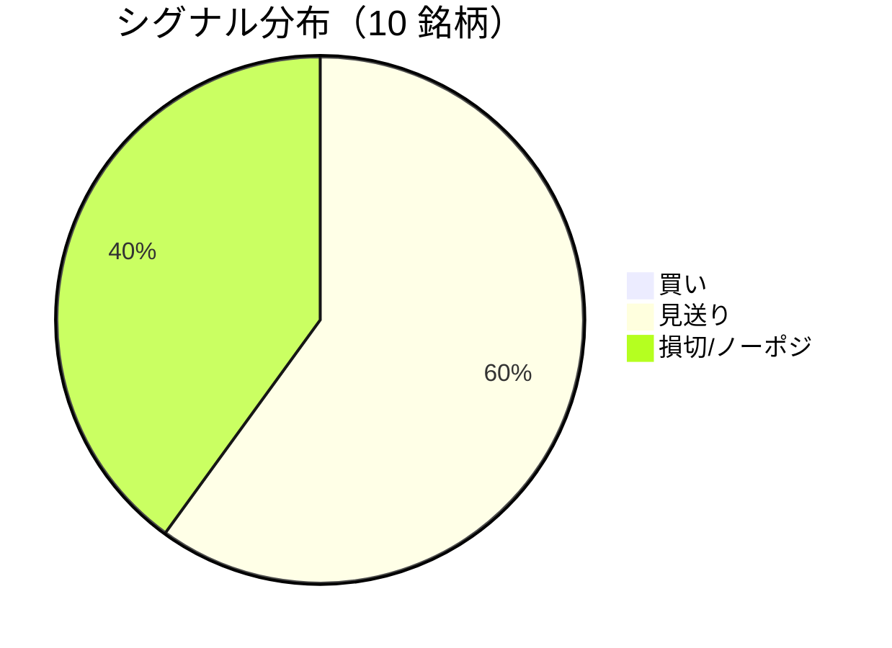

LightGBM + トリプルバリア法による自動取引エージェントの日次ログです。
本記事は GitHub 連携により stock-app から自動生成されています。

:::message alert
**運用モード: デモ** — デモ環境でのシグナル・シミュレーション結果です。投資判断の参考情報であり、売買推奨ではありません。
:::

## 本日のサマリー

- 処理成功: **10** 銘柄 / 失敗: **0** 銘柄
- 🟢 買い: **0** / ⚪ 見送り: **6** / 🔴 損切・ノーポジ: **4**

## マーケット環境（2026-08-14 時点・5日リターン）

| 指標 | 5日リターン |
| --- | ---: |
| USD/JPY | +0.64% |
| 日経平均 | +4.74% |
| S&P 500 | +0.36% |

## 銘柄別シグナル

| 銘柄 | ティッカー | シグナル | 終値(円) | 利確確率 | 勝率 | PF | 最大DD | リターン |
| --- | --- | --- | ---: | ---: | ---: | ---: | ---: | ---: |
| 第一三共 | `4568.T` | ⚪ 見送り | 2,729 | 24.4% | 52.6% | 1.06 | -32.2% | +8.14% |
| 日立製作所 | `6501.T` | ⚪ 見送り | 5,767 | 10.4% | 57.7% | 2.19 | -16.8% | +55.84% |
| 富士通 | `6702.T` | ⚪ 見送り | 3,841 | 4.2% | 23.1% | 0.45 | -30.6% | -23.10% |
| ルネサスエレクトロニクス | `6723.T` | 🔴 ノーポジション | 3,746 | 26.3% | 46.2% | 1.51 | -19.8% | +101.09% |
| ソニーグループ | `6758.T` | 🔴 ノーポジション | 3,912 | 16.4% | 35.6% | 1.07 | -28.5% | +7.95% |
| 三菱重工業 | `7011.T` | 🔴 ノーポジション | 4,254 | 36.1% | 46.6% | 1.16 | -38.2% | +63.90% |
| 本田技研工業 | `7267.T` | ⚪ 見送り | 1,658 | 3.5% | 33.3% | 1.31 | -4.9% | +2.25% |
| SUBARU | `7270.T` | ⚪ 見送り | 2,583 | 8.5% | 60.0% | 4.86 | -9.6% | +21.05% |
| イオン | `8267.T` | ⚪ 見送り | 1,374 | 0.5% | 16.7% | 0.13 | -19.4% | -19.44% |
| 三菱UFJフィナンシャル | `8306.T` | 🔴 ノーポジション | 3,686 | 7.2% | 40.0% | 1.14 | -14.9% | +3.62% |

## パフォーマンスランキング（バックテスト）

### 上位 3 銘柄

| 銘柄 | ティッカー | リターン | 勝率 | PF |
| --- | --- | ---: | ---: | ---: |
| 🥇 ルネサスエレクトロニクス | `6723.T` | +101.09% | 46.2% | 1.51 |
| 🥈 三菱重工業 | `7011.T` | +63.90% | 46.6% | 1.16 |
| 🥉 日立製作所 | `6501.T` | +55.84% | 57.7% | 2.19 |

### 下位 3 銘柄

| 銘柄 | ティッカー | リターン | 勝率 | PF |
| --- | --- | ---: | ---: | ---: |
| 📉 富士通 | `6702.T` | -23.10% | 23.1% | 0.45 |
| 📉 イオン | `8267.T` | -19.44% | 16.7% | 0.13 |
| 📉 本田技研工業 | `7267.T` | +2.25% | 33.3% | 1.31 |

## 買いシグナル詳細

🟢 本日の買いシグナルはありません。

## バックテスト平均（10 銘柄）

| 指標 | 値 |
| --- | ---: |
| 平均勝率 | 41.2% |
| 平均 PF | 1.49 |
| 平均リターン | +22.13% |
| 平均最大 DD | -21.5% |
| 平均シャープ | 0.20 |

## 実取引実績（SQLite）

まだ実取引の記録がありません。

## Live 予測の答え合わせ（直近 30 日）

:::message
バックテストとは別に、**毎日の live シグナル**を SQLite に記録し、エントリー（翌営業日始値）から **predict_horizon 日**後にトリプルバリア outcome を採点しています。
:::

| 指標 | 値 |
| --- | ---: |
| 採点済みシグナル | 141 件 |
| 全体一致率 | 35.5% |
| 買いシグナル一致率 | 37.5%（16 件） |
| 買いシグナル平均リターン（反実仮想） | +0.10% |

### シグナル別一致率

| シグナル | 件数 | 採点済 | 一致率 |
| --- | ---: | ---: | ---: |
| 🟢 買い | 16 | 16 | 37.5% |
| ⚪ 見送り | 81 | 81 | 27.2% |
| 🔴 ノーポジション | 44 | 44 | 50.0% |

### 直近の採点結果

- ✅ **2026-08-11** ソニーグループ: 予測=🔴 ノーポジション → 実際=損切 (StopLoss, -2.04%)
- ❌ **2026-08-11** 三菱重工業: 予測=🔴 ノーポジション → 実際=利確 (TakeProfit, +4.56%)
- ✅ **2026-08-10** ソニーグループ: 予測=🔴 ノーポジション → 実際=損切 (StopLoss, -2.04%)
- ✅ **2026-08-10** 三菱重工業: 予測=🟢 買い → 実際=利確 (TakeProfit, +4.56%)
- ✅ **2026-08-07** 富士通: 予測=⚪ 見送り → 実際=タイムアウト (Timeout, -1.16%)

## モデル概要

- **手法**: LightGBM ウォークフォワード + トリプルバリア法（3値分類）
- **特徴量**: テクニカル（SMA/RSI/MACD/ボリンジャー等）+ マクロ（USD/JPY, 日経, S&P500）
- **データリーク**: 全特徴量にラグ処理済み（未来情報なし）
- **買い判定**: 利確クラス確率 > 損切クラス確率 かつ 閾値超え

---

*このシリーズの過去ログをまとめた有料版は Zenn Books で公開予定です。*
