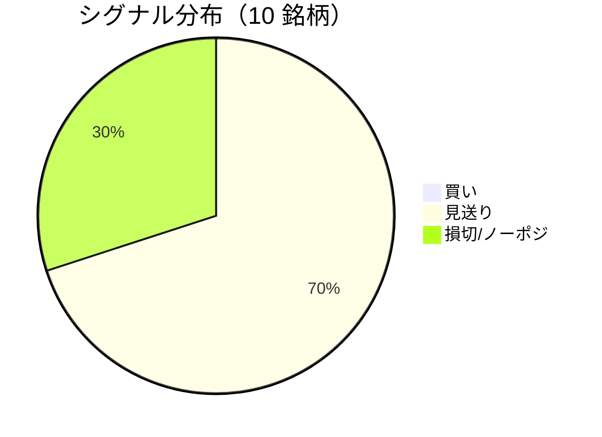

LightGBM + トリプルバリア法による自動取引エージェントの日次ログです。
本記事は GitHub 連携により stock-app から自動生成されています。

:::message alert
**運用モード: デモ** — デモ環境でのシグナル・シミュレーション結果です。投資判断の参考情報であり、売買推奨ではありません。
:::

## 本日のサマリー

- 処理成功: **10** 銘柄 / 失敗: **0** 銘柄
- 🟢 買い: **0** / ⚪ 見送り: **7** / 🔴 損切・ノーポジ: **3**

## マーケット環境（2026-08-19 時点・5日リターン）

| 指標 | 5日リターン |
| --- | ---: |
| USD/JPY | +0.18% |
| 日経平均 | -3.25% |
| S&P 500 | -0.52% |

## 銘柄別シグナル

| 銘柄 | ティッカー | シグナル | 終値(円) | 利確確率 | 勝率 | PF | 最大DD | リターン |
| --- | --- | --- | ---: | ---: | ---: | ---: | ---: | ---: |
| 第一三共 | `4568.T` | ⚪ 見送り | 2,729 | 26.2% | 47.5% | 0.92 | -37.2% | -5.44% |
| 日立製作所 | `6501.T` | ⚪ 見送り | 5,225 | 9.6% | 53.8% | 1.80 | -20.4% | +44.73% |
| 富士通 | `6702.T` | ⚪ 見送り | 3,607 | 7.6% | 33.3% | 0.66 | -18.3% | -11.23% |
| ルネサスエレクトロニクス | `6723.T` | 🔴 ノーポジション | 3,462 | 29.2% | 47.4% | 1.60 | -15.2% | +117.41% |
| ソニーグループ | `6758.T` | 🔴 ノーポジション | 3,689 | 16.9% | 35.7% | 1.12 | -22.8% | +10.24% |
| 三菱重工業 | `7011.T` | 🔴 ノーポジション | 4,097 | 44.3% | 50.0% | 1.28 | -35.0% | +113.11% |
| 本田技研工業 | `7267.T` | ⚪ 見送り | 1,662 | 2.7% | 66.7% | 3.70 | -4.9% | +13.63% |
| SUBARU | `7270.T` | ⚪ 見送り | 2,518 | 0.4% | 66.7% | 3.78 | -9.6% | +14.65% |
| イオン | `8267.T` | ⚪ 見送り | 1,361 | 2.2% | 16.7% | 0.14 | -19.4% | -19.44% |
| 三菱UFJフィナンシャル | `8306.T` | ⚪ 見送り | 3,495 | 7.1% | 57.1% | 2.37 | -7.5% | +22.63% |

## パフォーマンスランキング（バックテスト）

### 上位 3 銘柄

| 銘柄 | ティッカー | リターン | 勝率 | PF |
| --- | --- | ---: | ---: | ---: |
| 🥇 ルネサスエレクトロニクス | `6723.T` | +117.41% | 47.4% | 1.60 |
| 🥈 三菱重工業 | `7011.T` | +113.11% | 50.0% | 1.28 |
| 🥉 日立製作所 | `6501.T` | +44.73% | 53.8% | 1.80 |

### 下位 3 銘柄

| 銘柄 | ティッカー | リターン | 勝率 | PF |
| --- | --- | ---: | ---: | ---: |
| 📉 イオン | `8267.T` | -19.44% | 16.7% | 0.14 |
| 📉 富士通 | `6702.T` | -11.23% | 33.3% | 0.66 |
| 📉 第一三共 | `4568.T` | -5.44% | 47.5% | 0.92 |

## 買いシグナル詳細

🟢 本日の買いシグナルはありません。

## バックテスト平均（10 銘柄）

| 指標 | 値 |
| --- | ---: |
| 平均勝率 | 47.5% |
| 平均 PF | 1.74 |
| 平均リターン | +30.03% |
| 平均最大 DD | -19.0% |
| 平均シャープ | 0.29 |

## 実取引実績（SQLite）

まだ実取引の記録がありません。

## Live 予測の答え合わせ（直近 30 日）

:::message
バックテストとは別に、**毎日の live シグナル**を SQLite に記録し、エントリー（翌営業日始値）から **predict_horizon 日**後にトリプルバリア outcome を採点しています。
:::

| 指標 | 値 |
| --- | ---: |
| 採点済みシグナル | 163 件 |
| 全体一致率 | 36.8% |
| 買いシグナル一致率 | 33.3%（15 件） |
| 買いシグナル平均リターン（反実仮想） | -0.20% |

### シグナル別一致率

| シグナル | 件数 | 採点済 | 一致率 |
| --- | ---: | ---: | ---: |
| 🟢 買い | 15 | 15 | 33.3% |
| ⚪ 見送り | 97 | 97 | 27.8% |
| 🔴 ノーポジション | 51 | 51 | 54.9% |

### 直近の採点結果

- ✅ **2026-08-18** ルネサスエレクトロニクス: 予測=🔴 ノーポジション → 実際=損切 (StopLoss, -3.10%)
- ✅ **2026-08-18** ソニーグループ: 予測=🔴 ノーポジション → 実際=損切 (StopLoss, -2.04%)
- ✅ **2026-08-18** 三菱重工業: 予測=🔴 ノーポジション → 実際=損切 (StopLoss, -2.58%)
- ❌ **2026-08-18** 三菱UFJフィナンシャル: 予測=⚪ 見送り → 実際=損切 (StopLoss, -2.19%)
- ❌ **2026-08-17** 第一三共: 予測=⚪ 見送り → 実際=利確 (TakeProfit, +6.28%)

## モデル概要

- **手法**: LightGBM ウォークフォワード + トリプルバリア法（3値分類）
- **特徴量**: テクニカル（SMA/RSI/MACD/ボリンジャー等）+ マクロ（USD/JPY, 日経, S&P500）
- **データリーク**: 全特徴量にラグ処理済み（未来情報なし）
- **買い判定**: 利確クラス確率 > 損切クラス確率 かつ 閾値超え

---

*このシリーズの過去ログをまとめた有料版は Zenn Books で公開予定です。*
