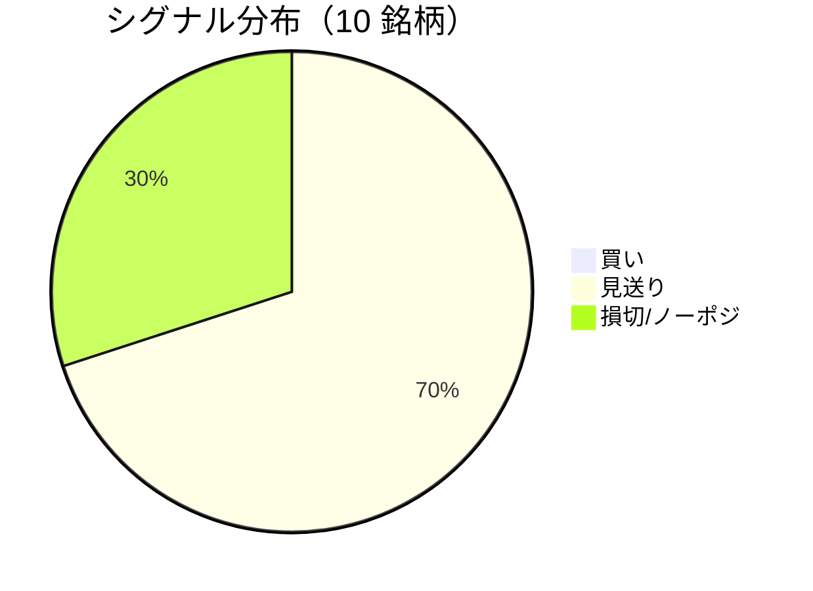

LightGBM + トリプルバリア法による自動取引エージェントの日次ログです。
本記事は GitHub 連携により stock-app から自動生成されています。

:::message alert
**運用モード: デモ** — デモ環境でのシグナル・シミュレーション結果です。投資判断の参考情報であり、売買推奨ではありません。
:::

## 本日のサマリー

- 処理成功: **10** 銘柄 / 失敗: **0** 銘柄
- 🟢 買い: **0** / ⚪ 見送り: **7** / 🔴 損切・ノーポジ: **3**

## マーケット環境（2026-08-21 時点・5日リターン）

| 指標 | 5日リターン |
| --- | ---: |
| USD/JPY | -0.34% |
| 日経平均 | -3.93% |
| S&P 500 | -1.43% |

## 銘柄別シグナル

| 銘柄 | ティッカー | シグナル | 終値(円) | 利確確率 | 勝率 | PF | 最大DD | リターン |
| --- | --- | --- | ---: | ---: | ---: | ---: | ---: | ---: |
| 第一三共 | `4568.T` | ⚪ 見送り | 2,834 | 24.6% | 51.2% | 1.01 | -38.4% | +3.27% |
| 日立製作所 | `6501.T` | ⚪ 見送り | 5,196 | 9.5% | 58.3% | 2.40 | -20.4% | +62.84% |
| 富士通 | `6702.T` | ⚪ 見送り | 3,646 | 8.9% | 31.8% | 0.74 | -13.3% | -8.05% |
| ルネサスエレクトロニクス | `6723.T` | 🔴 ノーポジション | 3,433 | 20.3% | 44.6% | 1.41 | -27.6% | +70.03% |
| ソニーグループ | `6758.T` | 🔴 ノーポジション | 3,785 | 17.0% | 40.0% | 1.26 | -18.5% | +20.15% |
| 三菱重工業 | `7011.T` | 🔴 ノーポジション | 3,932 | 34.7% | 44.1% | 1.06 | -36.1% | +24.92% |
| 本田技研工業 | `7267.T` | ⚪ 見送り | 1,753 | 2.6% | 66.7% | 3.20 | -4.9% | +11.95% |
| SUBARU | `7270.T` | ⚪ 見送り | 2,656 | 3.5% | 66.7% | 3.78 | -9.6% | +14.65% |
| イオン | `8267.T` | ⚪ 見送り | 1,386 | 0.9% | 35.7% | 0.39 | -19.5% | -16.24% |
| 三菱UFJフィナンシャル | `8306.T` | ⚪ 見送り | 3,508 | 7.2% | 42.1% | 1.55 | -9.2% | +16.88% |

## パフォーマンスランキング（バックテスト）

### 上位 3 銘柄

| 銘柄 | ティッカー | リターン | 勝率 | PF |
| --- | --- | ---: | ---: | ---: |
| 🥇 ルネサスエレクトロニクス | `6723.T` | +70.03% | 44.6% | 1.41 |
| 🥈 日立製作所 | `6501.T` | +62.84% | 58.3% | 2.40 |
| 🥉 三菱重工業 | `7011.T` | +24.92% | 44.1% | 1.06 |

### 下位 3 銘柄

| 銘柄 | ティッカー | リターン | 勝率 | PF |
| --- | --- | ---: | ---: | ---: |
| 📉 イオン | `8267.T` | -16.24% | 35.7% | 0.39 |
| 📉 富士通 | `6702.T` | -8.05% | 31.8% | 0.74 |
| 📉 第一三共 | `4568.T` | +3.27% | 51.2% | 1.01 |

## 買いシグナル詳細

🟢 本日の買いシグナルはありません。

## バックテスト平均（10 銘柄）

| 指標 | 値 |
| --- | ---: |
| 平均勝率 | 48.1% |
| 平均 PF | 1.68 |
| 平均リターン | +20.04% |
| 平均最大 DD | -19.8% |
| 平均シャープ | 0.28 |

## 実取引実績（SQLite）

まだ実取引の記録がありません。

## Live 予測の答え合わせ（直近 30 日）

:::message
バックテストとは別に、**毎日の live シグナル**を SQLite に記録し、エントリー（翌営業日始値）から **predict_horizon 日**後にトリプルバリア outcome を採点しています。
:::

| 指標 | 値 |
| --- | ---: |
| 採点済みシグナル | 132 件 |
| 全体一致率 | 43.2% |
| 買いシグナル一致率 | 36.4%（11 件） |
| 買いシグナル平均リターン（反実仮想） | +0.02% |

### シグナル別一致率

| シグナル | 件数 | 採点済 | 一致率 |
| --- | ---: | ---: | ---: |
| 🟢 買い | 11 | 11 | 36.4% |
| ⚪ 見送り | 80 | 80 | 35.0% |
| 🔴 ノーポジション | 41 | 41 | 61.0% |

### 直近の採点結果

- ✅ **2026-08-20** 三菱重工業: 予測=🔴 ノーポジション → 実際=損切 (StopLoss, -2.58%)
- ✅ **2026-08-19** ルネサスエレクトロニクス: 予測=🔴 ノーポジション → 実際=損切 (StopLoss, -3.10%)
- ✅ **2026-08-19** 三菱重工業: 予測=🔴 ノーポジション → 実際=損切 (StopLoss, -2.58%)
- ✅ **2026-08-18** ルネサスエレクトロニクス: 予測=🔴 ノーポジション → 実際=損切 (StopLoss, -3.10%)
- ✅ **2026-08-18** ソニーグループ: 予測=🔴 ノーポジション → 実際=損切 (StopLoss, -2.04%)

## モデル概要

- **手法**: LightGBM ウォークフォワード + トリプルバリア法（3値分類）
- **特徴量**: テクニカル（SMA/RSI/MACD/ボリンジャー等）+ マクロ（USD/JPY, 日経, S&P500）
- **データリーク**: 全特徴量にラグ処理済み（未来情報なし）
- **買い判定**: 利確クラス確率 > 損切クラス確率 かつ 閾値超え

---

*このシリーズの過去ログをまとめた有料版は Zenn Books で公開予定です。*
