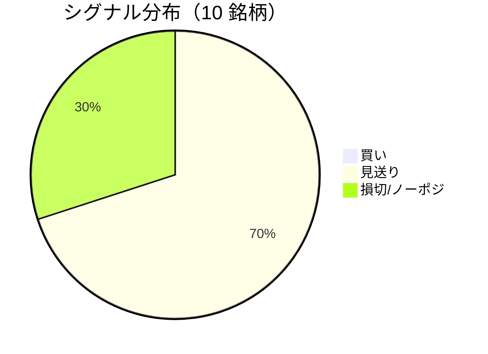

LightGBM + トリプルバリア法による自動取引エージェントの日次ログです。
本記事は GitHub 連携により stock-app から自動生成されています。

:::message alert
**運用モード: デモ** — デモ環境でのシグナル・シミュレーション結果です。投資判断の参考情報であり、売買推奨ではありません。
:::

## 本日のサマリー

- 処理成功: **10** 銘柄 / 失敗: **0** 銘柄
- 🟢 買い: **0** / ⚪ 見送り: **7** / 🔴 損切・ノーポジ: **3**

## マーケット環境（2026-08-25 時点・5日リターン）

| 指標 | 5日リターン |
| --- | ---: |
| USD/JPY | -0.13% |
| 日経平均 | -2.38% |
| S&P 500 | -0.19% |

## 銘柄別シグナル

| 銘柄 | ティッカー | シグナル | 終値(円) | 利確確率 | 勝率 | PF | 最大DD | リターン |
| --- | --- | --- | ---: | ---: | ---: | ---: | ---: | ---: |
| 第一三共 | `4568.T` | ⚪ 見送り | 2,830 | 23.5% | 48.7% | 0.91 | -40.1% | -7.90% |
| 日立製作所 | `6501.T` | ⚪ 見送り | 5,300 | 10.2% | 46.2% | 1.46 | -32.7% | +28.37% |
| 富士通 | `6702.T` | ⚪ 見送り | 3,728 | 6.5% | 36.4% | 0.87 | -25.1% | -5.11% |
| ルネサスエレクトロニクス | `6723.T` | 🔴 ノーポジション | 3,402 | 29.0% | 40.7% | 1.20 | -31.5% | +34.00% |
| ソニーグループ | `6758.T` | 🔴 ノーポジション | 3,832 | 16.8% | 36.7% | 1.17 | -22.0% | +14.34% |
| 三菱重工業 | `7011.T` | 🔴 ノーポジション | 3,946 | 31.6% | 46.0% | 1.11 | -38.1% | +40.86% |
| 本田技研工業 | `7267.T` | ⚪ 見送り | 1,696 | 3.3% | 50.0% | 1.77 | -4.9% | +3.93% |
| SUBARU | `7270.T` | ⚪ 見送り | 2,613 | 0.7% | 50.0% | 3.66 | -9.6% | +14.52% |
| イオン | `8267.T` | ⚪ 見送り | 1,396 | 1.9% | 10.0% | 0.02 | -20.3% | -19.96% |
| 三菱UFJフィナンシャル | `8306.T` | ⚪ 見送り | 3,529 | 10.6% | 55.0% | 2.07 | -7.3% | +26.18% |

## パフォーマンスランキング（バックテスト）

### 上位 3 銘柄

| 銘柄 | ティッカー | リターン | 勝率 | PF |
| --- | --- | ---: | ---: | ---: |
| 🥇 三菱重工業 | `7011.T` | +40.86% | 46.0% | 1.11 |
| 🥈 ルネサスエレクトロニクス | `6723.T` | +34.00% | 40.7% | 1.20 |
| 🥉 日立製作所 | `6501.T` | +28.37% | 46.2% | 1.46 |

### 下位 3 銘柄

| 銘柄 | ティッカー | リターン | 勝率 | PF |
| --- | --- | ---: | ---: | ---: |
| 📉 イオン | `8267.T` | -19.96% | 10.0% | 0.02 |
| 📉 第一三共 | `4568.T` | -7.90% | 48.7% | 0.91 |
| 📉 富士通 | `6702.T` | -5.11% | 36.4% | 0.87 |

## 買いシグナル詳細

🟢 本日の買いシグナルはありません。

## バックテスト平均（10 銘柄）

| 指標 | 値 |
| --- | ---: |
| 平均勝率 | 42.0% |
| 平均 PF | 1.42 |
| 平均リターン | +12.92% |
| 平均最大 DD | -23.2% |
| 平均シャープ | 0.17 |

## 実取引実績（SQLite）

まだ実取引の記録がありません。

## Live 予測の答え合わせ（直近 30 日）

:::message
バックテストとは別に、**毎日の live シグナル**を SQLite に記録し、エントリー（翌営業日始値）から **predict_horizon 日**後にトリプルバリア outcome を採点しています。
:::

| 指標 | 値 |
| --- | ---: |
| 採点済みシグナル | 142 件 |
| 全体一致率 | 45.8% |
| 買いシグナル一致率 | 36.4%（11 件） |
| 買いシグナル平均リターン（反実仮想） | +0.02% |

### シグナル別一致率

| シグナル | 件数 | 採点済 | 一致率 |
| --- | ---: | ---: | ---: |
| 🟢 買い | 11 | 11 | 36.4% |
| ⚪ 見送り | 87 | 87 | 39.1% |
| 🔴 ノーポジション | 44 | 44 | 61.4% |

### 直近の採点結果

- ✅ **2026-08-21** ルネサスエレクトロニクス: 予測=🔴 ノーポジション → 実際=損切 (StopLoss, -3.10%)
- ✅ **2026-08-20** ルネサスエレクトロニクス: 予測=🔴 ノーポジション → 実際=損切 (StopLoss, -3.10%)
- ✅ **2026-08-20** 三菱重工業: 予測=🔴 ノーポジション → 実際=損切 (StopLoss, -2.58%)
- ✅ **2026-08-19** 富士通: 予測=⚪ 見送り → 実際=タイムアウト (Timeout, +0.00%)
- ✅ **2026-08-19** ルネサスエレクトロニクス: 予測=🔴 ノーポジション → 実際=損切 (StopLoss, -3.10%)

## モデル概要

- **手法**: LightGBM ウォークフォワード + トリプルバリア法（3値分類）
- **特徴量**: テクニカル（SMA/RSI/MACD/ボリンジャー等）+ マクロ（USD/JPY, 日経, S&P500）
- **データリーク**: 全特徴量にラグ処理済み（未来情報なし）
- **買い判定**: 利確クラス確率 > 損切クラス確率 かつ 閾値超え

---

*このシリーズの過去ログをまとめた有料版は Zenn Books で公開予定です。*
