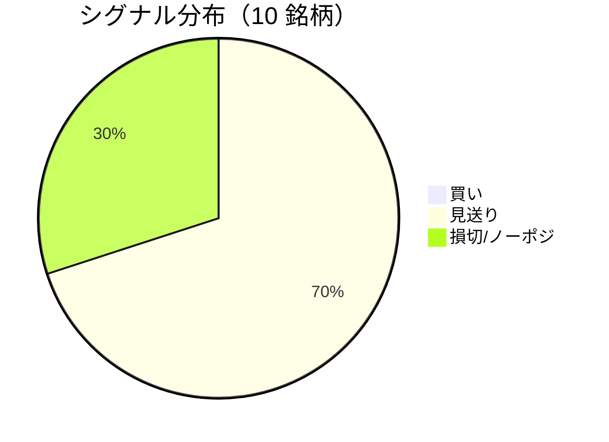

LightGBM + トリプルバリア法による自動取引エージェントの日次ログです。
本記事は GitHub 連携により stock-app から自動生成されています。

:::message alert
**運用モード: デモ** — デモ環境でのシグナル・シミュレーション結果です。投資判断の参考情報であり、売買推奨ではありません。
:::

## 本日のサマリー

- 処理成功: **10** 銘柄 / 失敗: **0** 銘柄
- 🟢 買い: **0** / ⚪ 見送り: **7** / 🔴 損切・ノーポジ: **3**

## マーケット環境（2026-08-26 時点・5日リターン）

| 指標 | 5日リターン |
| --- | ---: |
| USD/JPY | -0.20% |
| 日経平均 | +1.43% |
| S&P 500 | -0.42% |

## 銘柄別シグナル

| 銘柄 | ティッカー | シグナル | 終値(円) | 利確確率 | 勝率 | PF | 最大DD | リターン |
| --- | --- | --- | ---: | ---: | ---: | ---: | ---: | ---: |
| 第一三共 | `4568.T` | ⚪ 見送り | 2,900 | 25.8% | 48.8% | 0.85 | -43.0% | -14.33% |
| 日立製作所 | `6501.T` | ⚪ 見送り | 5,307 | 9.4% | 52.2% | 1.81 | -22.6% | +35.14% |
| 富士通 | `6702.T` | ⚪ 見送り | 3,716 | 6.6% | 35.5% | 0.80 | -24.8% | -8.15% |
| ルネサスエレクトロニクス | `6723.T` | 🔴 ノーポジション | 3,372 | 29.4% | 50.0% | 1.76 | -25.2% | +129.42% |
| ソニーグループ | `6758.T` | 🔴 ノーポジション | 3,878 | 16.8% | 38.6% | 1.21 | -20.2% | +15.84% |
| 三菱重工業 | `7011.T` | 🔴 ノーポジション | 3,920 | 33.0% | 45.1% | 1.08 | -42.9% | +31.42% |
| 本田技研工業 | `7267.T` | ⚪ 見送り | 1,674 | 2.5% | 50.0% | 1.77 | -4.9% | +3.93% |
| SUBARU | `7270.T` | ⚪ 見送り | 2,626 | 3.3% | 60.0% | 5.29 | -9.6% | +25.61% |
| イオン | `8267.T` | ⚪ 見送り | 1,384 | 0.6% | 18.2% | 0.15 | -21.2% | -17.70% |
| 三菱UFJフィナンシャル | `8306.T` | ⚪ 見送り | 3,579 | 11.1% | 60.0% | 2.51 | -7.9% | +25.14% |

## パフォーマンスランキング（バックテスト）

### 上位 3 銘柄

| 銘柄 | ティッカー | リターン | 勝率 | PF |
| --- | --- | ---: | ---: | ---: |
| 🥇 ルネサスエレクトロニクス | `6723.T` | +129.42% | 50.0% | 1.76 |
| 🥈 日立製作所 | `6501.T` | +35.14% | 52.2% | 1.81 |
| 🥉 三菱重工業 | `7011.T` | +31.42% | 45.1% | 1.08 |

### 下位 3 銘柄

| 銘柄 | ティッカー | リターン | 勝率 | PF |
| --- | --- | ---: | ---: | ---: |
| 📉 イオン | `8267.T` | -17.70% | 18.2% | 0.15 |
| 📉 第一三共 | `4568.T` | -14.33% | 48.8% | 0.85 |
| 📉 富士通 | `6702.T` | -8.15% | 35.5% | 0.80 |

## 買いシグナル詳細

🟢 本日の買いシグナルはありません。

## バックテスト平均（10 銘柄）

| 指標 | 値 |
| --- | ---: |
| 平均勝率 | 45.8% |
| 平均 PF | 1.72 |
| 平均リターン | +22.63% |
| 平均最大 DD | -22.2% |
| 平均シャープ | 0.25 |

## 実取引実績（SQLite）

まだ実取引の記録がありません。

## Live 予測の答え合わせ（直近 30 日）

:::message
バックテストとは別に、**毎日の live シグナル**を SQLite に記録し、エントリー（翌営業日始値）から **predict_horizon 日**後にトリプルバリア outcome を採点しています。
:::

| 指標 | 値 |
| --- | ---: |
| 採点済みシグナル | 139 件 |
| 全体一致率 | 48.2% |
| 買いシグナル一致率 | 40.0%（10 件） |
| 買いシグナル平均リターン（反実仮想） | +0.28% |

### シグナル別一致率

| シグナル | 件数 | 採点済 | 一致率 |
| --- | ---: | ---: | ---: |
| 🟢 買い | 10 | 10 | 40.0% |
| ⚪ 見送り | 86 | 86 | 41.9% |
| 🔴 ノーポジション | 43 | 43 | 62.8% |

### 直近の採点結果

- ✅ **2026-08-26** ルネサスエレクトロニクス: 予測=🔴 ノーポジション → 実際=損切 (StopLoss, -3.10%)
- ✅ **2026-08-21** ルネサスエレクトロニクス: 予測=🔴 ノーポジション → 実際=損切 (StopLoss, -3.10%)
- ❌ **2026-08-21** 本田技研工業: 予測=⚪ 見送り → 実際=損切 (StopLoss, -4.70%)
- ✅ **2026-08-20** 富士通: 予測=⚪ 見送り → 実際=タイムアウト (Timeout, +1.98%)
- ✅ **2026-08-20** ルネサスエレクトロニクス: 予測=🔴 ノーポジション → 実際=損切 (StopLoss, -3.10%)

## モデル概要

- **手法**: LightGBM ウォークフォワード + トリプルバリア法（3値分類）
- **特徴量**: テクニカル（SMA/RSI/MACD/ボリンジャー等）+ マクロ（USD/JPY, 日経, S&P500）
- **データリーク**: 全特徴量にラグ処理済み（未来情報なし）
- **買い判定**: 利確クラス確率 > 損切クラス確率 かつ 閾値超え

---

*このシリーズの過去ログをまとめた有料版は Zenn Books で公開予定です。*
