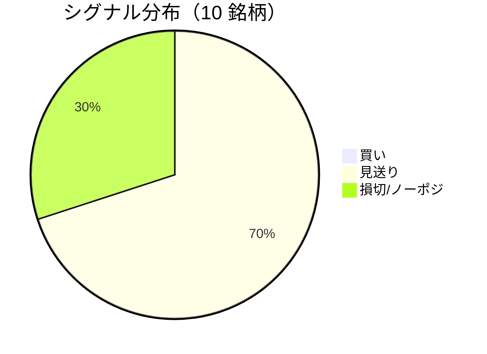

LightGBM + トリプルバリア法による自動取引エージェントの日次ログです。
本記事は GitHub 連携により stock-app から自動生成されています。

:::message alert
**運用モード: デモ** — デモ環境でのシグナル・シミュレーション結果です。投資判断の参考情報であり、売買推奨ではありません。
:::

## 本日のサマリー

- 処理成功: **10** 銘柄 / 失敗: **0** 銘柄
- 🟢 買い: **0** / ⚪ 見送り: **7** / 🔴 損切・ノーポジ: **3**

## マーケット環境（2026-08-27 時点・5日リターン）

| 指標 | 5日リターン |
| --- | ---: |
| USD/JPY | +0.62% |
| 日経平均 | -0.13% |
| S&P 500 | +1.18% |

## 銘柄別シグナル

| 銘柄 | ティッカー | シグナル | 終値(円) | 利確確率 | 勝率 | PF | 最大DD | リターン |
| --- | --- | --- | ---: | ---: | ---: | ---: | ---: | ---: |
| 第一三共 | `4568.T` | ⚪ 見送り | 2,886 | 24.8% | 53.5% | 1.03 | -34.0% | +6.47% |
| 日立製作所 | `6501.T` | ⚪ 見送り | 5,433 | 9.6% | 47.6% | 1.70 | -22.6% | +30.24% |
| 富士通 | `6702.T` | ⚪ 見送り | 3,753 | 5.7% | 31.2% | 0.67 | -28.0% | -15.61% |
| ルネサスエレクトロニクス | `6723.T` | 🔴 ノーポジション | 3,380 | 24.9% | 47.1% | 1.61 | -25.2% | +94.81% |
| ソニーグループ | `6758.T` | 🔴 ノーポジション | 3,870 | 16.8% | 31.8% | 0.93 | -27.4% | -2.29% |
| 三菱重工業 | `7011.T` | 🔴 ノーポジション | 3,985 | 28.8% | 45.7% | 1.11 | -38.6% | +41.24% |
| 本田技研工業 | `7267.T` | ⚪ 見送り | 1,662 | 2.6% | 50.0% | 2.37 | -4.9% | +10.14% |
| SUBARU | `7270.T` | ⚪ 見送り | 2,585 | 4.5% | 60.0% | 5.29 | -9.6% | +25.61% |
| イオン | `8267.T` | ⚪ 見送り | 1,346 | 0.6% | 16.7% | 0.13 | -24.8% | -21.45% |
| 三菱UFJフィナンシャル | `8306.T` | ⚪ 見送り | 3,608 | 11.0% | 60.0% | 2.26 | -9.7% | +23.36% |

## パフォーマンスランキング（バックテスト）

### 上位 3 銘柄

| 銘柄 | ティッカー | リターン | 勝率 | PF |
| --- | --- | ---: | ---: | ---: |
| 🥇 ルネサスエレクトロニクス | `6723.T` | +94.81% | 47.1% | 1.61 |
| 🥈 三菱重工業 | `7011.T` | +41.24% | 45.7% | 1.11 |
| 🥉 日立製作所 | `6501.T` | +30.24% | 47.6% | 1.70 |

### 下位 3 銘柄

| 銘柄 | ティッカー | リターン | 勝率 | PF |
| --- | --- | ---: | ---: | ---: |
| 📉 イオン | `8267.T` | -21.45% | 16.7% | 0.13 |
| 📉 富士通 | `6702.T` | -15.61% | 31.2% | 0.67 |
| 📉 ソニーグループ | `6758.T` | -2.29% | 31.8% | 0.93 |

## 買いシグナル詳細

🟢 本日の買いシグナルはありません。

## バックテスト平均（10 銘柄）

| 指標 | 値 |
| --- | ---: |
| 平均勝率 | 44.4% |
| 平均 PF | 1.71 |
| 平均リターン | +19.25% |
| 平均最大 DD | -22.5% |
| 平均シャープ | 0.22 |

## 実取引実績（SQLite）

まだ実取引の記録がありません。

## Live 予測の答え合わせ（直近 30 日）

:::message
バックテストとは別に、**毎日の live シグナル**を SQLite に記録し、エントリー（翌営業日始値）から **predict_horizon 日**後にトリプルバリア outcome を採点しています。
:::

| 指標 | 値 |
| --- | ---: |
| 採点済みシグナル | 139 件 |
| 全体一致率 | 49.6% |
| 買いシグナル一致率 | 44.4%（9 件） |
| 買いシグナル平均リターン（反実仮想） | +0.59% |

### シグナル別一致率

| シグナル | 件数 | 採点済 | 一致率 |
| --- | ---: | ---: | ---: |
| 🟢 買い | 9 | 9 | 44.4% |
| ⚪ 見送り | 84 | 84 | 45.2% |
| 🔴 ノーポジション | 46 | 46 | 58.7% |

### 直近の採点結果

- ✅ **2026-08-27** ルネサスエレクトロニクス: 予測=🔴 ノーポジション → 実際=損切 (StopLoss, -3.10%)
- ❌ **2026-08-26** 富士通: 予測=⚪ 見送り → 実際=利確 (TakeProfit, +5.67%)
- ✅ **2026-08-26** ルネサスエレクトロニクス: 予測=🔴 ノーポジション → 実際=損切 (StopLoss, -3.10%)
- ❌ **2026-08-25** 富士通: 予測=🔴 ノーポジション → 実際=利確 (TakeProfit, +5.67%)
- ❌ **2026-08-24** 富士通: 予測=⚪ 見送り → 実際=利確 (TakeProfit, +5.67%)

## モデル概要

- **手法**: LightGBM ウォークフォワード + トリプルバリア法（3値分類）
- **特徴量**: テクニカル（SMA/RSI/MACD/ボリンジャー等）+ マクロ（USD/JPY, 日経, S&P500）
- **データリーク**: 全特徴量にラグ処理済み（未来情報なし）
- **買い判定**: 利確クラス確率 > 損切クラス確率 かつ 閾値超え

---

*このシリーズの過去ログをまとめた有料版は Zenn Books で公開予定です。*
