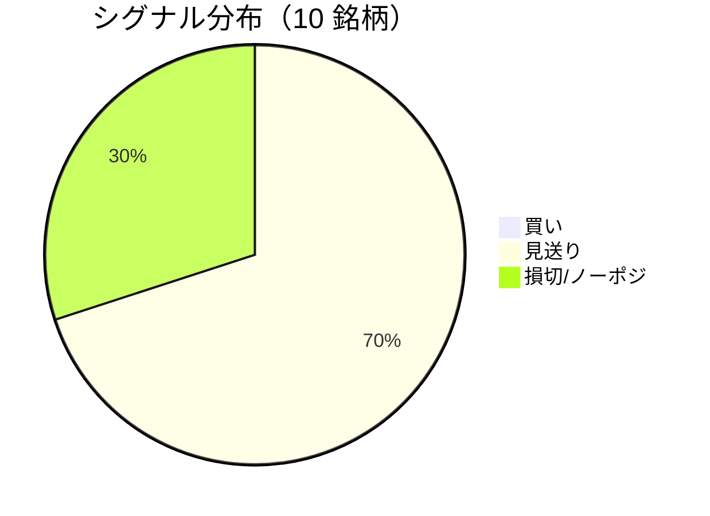

LightGBM + トリプルバリア法による自動取引エージェントの日次ログです。
本記事は GitHub 連携により stock-app から自動生成されています。

:::message alert
**運用モード: デモ** — デモ環境でのシグナル・シミュレーション結果です。投資判断の参考情報であり、売買推奨ではありません。
:::

## 本日のサマリー

- 処理成功: **10** 銘柄 / 失敗: **0** 銘柄
- 🟢 買い: **0** / ⚪ 見送り: **7** / 🔴 損切・ノーポジ: **3**

## マーケット環境（2026-08-28 時点・5日リターン）

| 指標 | 5日リターン |
| --- | ---: |
| USD/JPY | +0.28% |
| 日経平均 | +0.18% |
| S&P 500 | +0.74% |

## 銘柄別シグナル

| 銘柄 | ティッカー | シグナル | 終値(円) | 利確確率 | 勝率 | PF | 最大DD | リターン |
| --- | --- | --- | ---: | ---: | ---: | ---: | ---: | ---: |
| 第一三共 | `4568.T` | ⚪ 見送り | 2,931 | 25.2% | 47.4% | 0.81 | -36.8% | -16.89% |
| 日立製作所 | `6501.T` | ⚪ 見送り | 5,550 | 10.0% | 42.9% | 1.17 | -20.4% | +9.00% |
| 富士通 | `6702.T` | ⚪ 見送り | 3,904 | 5.3% | 42.9% | 1.14 | -15.2% | +9.18% |
| ルネサスエレクトロニクス | `6723.T` | 🔴 ノーポジション | 3,417 | 25.5% | 52.1% | 1.83 | -16.2% | +183.54% |
| ソニーグループ | `6758.T` | 🔴 ノーポジション | 3,928 | 17.4% | 34.2% | 1.07 | -25.1% | +5.59% |
| 三菱重工業 | `7011.T` | 🔴 ノーポジション | 4,025 | 29.0% | 43.0% | 1.04 | -40.3% | +18.86% |
| 本田技研工業 | `7267.T` | ⚪ 見送り | 1,702 | 2.5% | 66.7% | 3.47 | -5.8% | +13.63% |
| SUBARU | `7270.T` | ⚪ 見送り | 2,639 | 3.3% | 60.0% | 3.43 | -7.2% | +17.45% |
| イオン | `8267.T` | ⚪ 見送り | 1,358 | 0.4% | 37.5% | 0.27 | -13.4% | -9.51% |
| 三菱UFJフィナンシャル | `8306.T` | ⚪ 見送り | 3,658 | 7.7% | 75.0% | 5.40 | -7.5% | +36.39% |

## パフォーマンスランキング（バックテスト）

### 上位 3 銘柄

| 銘柄 | ティッカー | リターン | 勝率 | PF |
| --- | --- | ---: | ---: | ---: |
| 🥇 ルネサスエレクトロニクス | `6723.T` | +183.54% | 52.1% | 1.83 |
| 🥈 三菱UFJフィナンシャル | `8306.T` | +36.39% | 75.0% | 5.40 |
| 🥉 三菱重工業 | `7011.T` | +18.86% | 43.0% | 1.04 |

### 下位 3 銘柄

| 銘柄 | ティッカー | リターン | 勝率 | PF |
| --- | --- | ---: | ---: | ---: |
| 📉 第一三共 | `4568.T` | -16.89% | 47.4% | 0.81 |
| 📉 イオン | `8267.T` | -9.51% | 37.5% | 0.27 |
| 📉 ソニーグループ | `6758.T` | +5.59% | 34.2% | 1.07 |

## 買いシグナル詳細

🟢 本日の買いシグナルはありません。

## バックテスト平均（10 銘柄）

| 指標 | 値 |
| --- | ---: |
| 平均勝率 | 50.2% |
| 平均 PF | 1.96 |
| 平均リターン | +26.72% |
| 平均最大 DD | -18.8% |
| 平均シャープ | 0.32 |

## 実取引実績（SQLite）

まだ実取引の記録がありません。

## Live 予測の答え合わせ（直近 30 日）

:::message
バックテストとは別に、**毎日の live シグナル**を SQLite に記録し、エントリー（翌営業日始値）から **predict_horizon 日**後にトリプルバリア outcome を採点しています。
:::

| 指標 | 値 |
| --- | ---: |
| 採点済みシグナル | 120 件 |
| 全体一致率 | 55.0% |
| 買いシグナル一致率 | 50.0%（6 件） |
| 買いシグナル平均リターン（反実仮想） | +0.99% |

### シグナル別一致率

| シグナル | 件数 | 採点済 | 一致率 |
| --- | ---: | ---: | ---: |
| 🟢 買い | 6 | 6 | 50.0% |
| ⚪ 見送り | 71 | 71 | 53.5% |
| 🔴 ノーポジション | 43 | 43 | 58.1% |

### 直近の採点結果

- ✅ **2026-08-28** 三菱重工業: 予測=🔴 ノーポジション → 実際=損切 (StopLoss, -2.58%)
- ✅ **2026-08-27** ルネサスエレクトロニクス: 予測=🔴 ノーポジション → 実際=損切 (StopLoss, -3.10%)
- ✅ **2026-08-27** 三菱重工業: 予測=🔴 ノーポジション → 実際=損切 (StopLoss, -2.58%)
- ❌ **2026-08-26** 富士通: 予測=⚪ 見送り → 実際=利確 (TakeProfit, +5.67%)
- ✅ **2026-08-26** ルネサスエレクトロニクス: 予測=🔴 ノーポジション → 実際=損切 (StopLoss, -3.10%)

## モデル概要

- **手法**: LightGBM ウォークフォワード + トリプルバリア法（3値分類）
- **特徴量**: テクニカル（SMA/RSI/MACD/ボリンジャー等）+ マクロ（USD/JPY, 日経, S&P500）
- **データリーク**: 全特徴量にラグ処理済み（未来情報なし）
- **買い判定**: 利確クラス確率 > 損切クラス確率 かつ 閾値超え

---

*このシリーズの過去ログをまとめた有料版は Zenn Books で公開予定です。*
