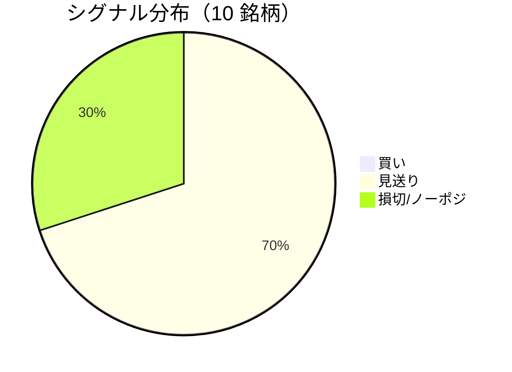

LightGBM + トリプルバリア法による自動取引エージェントの日次ログです。
本記事は GitHub 連携により stock-app から自動生成されています。

:::message alert
**運用モード: デモ** — デモ環境でのシグナル・シミュレーション結果です。投資判断の参考情報であり、売買推奨ではありません。
:::

## 本日のサマリー

- 処理成功: **10** 銘柄 / 失敗: **0** 銘柄
- 🟢 買い: **0** / ⚪ 見送り: **7** / 🔴 損切・ノーポジ: **3**

## マーケット環境（2026-09-01 時点・5日リターン）

| 指標 | 5日リターン |
| --- | ---: |
| USD/JPY | +0.38% |
| 日経平均 | +0.54% |
| S&P 500 | -0.60% |

## 銘柄別シグナル

| 銘柄 | ティッカー | シグナル | 終値(円) | 利確確率 | 勝率 | PF | 最大DD | リターン |
| --- | --- | --- | ---: | ---: | ---: | ---: | ---: | ---: |
| 第一三共 | `4568.T` | ⚪ 見送り | 2,850 | 25.1% | 50.0% | 0.91 | -34.5% | -7.48% |
| 日立製作所 | `6501.T` | ⚪ 見送り | 5,541 | 10.2% | 33.3% | 0.79 | -28.4% | -9.14% |
| 富士通 | `6702.T` | ⚪ 見送り | 3,947 | 5.9% | 38.2% | 0.95 | -17.4% | -1.20% |
| ルネサスエレクトロニクス | `6723.T` | 🔴 ノーポジション | 3,314 | 25.3% | 52.9% | 1.90 | -12.2% | +177.69% |
| ソニーグループ | `6758.T` | 🔴 ノーポジション | 4,046 | 17.0% | 43.2% | 1.50 | -17.5% | +27.51% |
| 三菱重工業 | `7011.T` | 🔴 ノーポジション | 3,856 | 31.9% | 40.8% | 0.97 | -43.7% | -0.25% |
| 本田技研工業 | `7267.T` | ⚪ 見送り | 1,733 | 2.6% | 50.0% | 1.70 | -4.9% | +3.93% |
| SUBARU | `7270.T` | ⚪ 見送り | 2,736 | 0.8% | 33.3% | 1.26 | -11.8% | +4.02% |
| イオン | `8267.T` | ⚪ 見送り | 1,360 | 0.5% | 27.3% | 0.47 | -20.0% | -10.78% |
| 三菱UFJフィナンシャル | `8306.T` | ⚪ 見送り | 3,700 | 7.6% | 81.8% | 9.58 | -7.5% | +42.81% |

## パフォーマンスランキング（バックテスト）

### 上位 3 銘柄

| 銘柄 | ティッカー | リターン | 勝率 | PF |
| --- | --- | ---: | ---: | ---: |
| 🥇 ルネサスエレクトロニクス | `6723.T` | +177.69% | 52.9% | 1.90 |
| 🥈 三菱UFJフィナンシャル | `8306.T` | +42.81% | 81.8% | 9.58 |
| 🥉 ソニーグループ | `6758.T` | +27.51% | 43.2% | 1.50 |

### 下位 3 銘柄

| 銘柄 | ティッカー | リターン | 勝率 | PF |
| --- | --- | ---: | ---: | ---: |
| 📉 イオン | `8267.T` | -10.78% | 27.3% | 0.47 |
| 📉 日立製作所 | `6501.T` | -9.14% | 33.3% | 0.79 |
| 📉 第一三共 | `4568.T` | -7.48% | 50.0% | 0.91 |

## 買いシグナル詳細

🟢 本日の買いシグナルはありません。

## バックテスト平均（10 銘柄）

| 指標 | 値 |
| --- | ---: |
| 平均勝率 | 45.1% |
| 平均 PF | 2.00 |
| 平均リターン | +22.71% |
| 平均最大 DD | -19.8% |
| 平均シャープ | 0.24 |

## 実取引実績（SQLite）

まだ実取引の記録がありません。

## Live 予測の答え合わせ（直近 30 日）

:::message
バックテストとは別に、**毎日の live シグナル**を SQLite に記録し、エントリー（翌営業日始値）から **predict_horizon 日**後にトリプルバリア outcome を採点しています。
:::

| 指標 | 値 |
| --- | ---: |
| 採点済みシグナル | 141 件 |
| 全体一致率 | 58.2% |
| 買いシグナル一致率 | 50.0%（6 件） |
| 買いシグナル平均リターン（反実仮想） | +0.99% |

### シグナル別一致率

| シグナル | 件数 | 採点済 | 一致率 |
| --- | ---: | ---: | ---: |
| 🟢 買い | 6 | 6 | 50.0% |
| ⚪ 見送り | 83 | 83 | 55.4% |
| 🔴 ノーポジション | 52 | 52 | 63.5% |

### 直近の採点結果

- ❌ **2026-09-01** 富士通: 予測=⚪ 見送り → 実際=損切 (StopLoss, -2.56%)
- ✅ **2026-09-01** ソニーグループ: 予測=🔴 ノーポジション → 実際=損切 (StopLoss, -2.04%)
- ✅ **2026-09-01** 三菱重工業: 予測=🔴 ノーポジション → 実際=損切 (StopLoss, -2.58%)
- ❌ **2026-08-31** 富士通: 予測=⚪ 見送り → 実際=損切 (StopLoss, -2.56%)
- ✅ **2026-08-31** ルネサスエレクトロニクス: 予測=🔴 ノーポジション → 実際=損切 (StopLoss, -3.10%)

## モデル概要

- **手法**: LightGBM ウォークフォワード + トリプルバリア法（3値分類）
- **特徴量**: テクニカル（SMA/RSI/MACD/ボリンジャー等）+ マクロ（USD/JPY, 日経, S&P500）
- **データリーク**: 全特徴量にラグ処理済み（未来情報なし）
- **買い判定**: 利確クラス確率 > 損切クラス確率 かつ 閾値超え

---

*このシリーズの過去ログをまとめた有料版は Zenn Books で公開予定です。*
