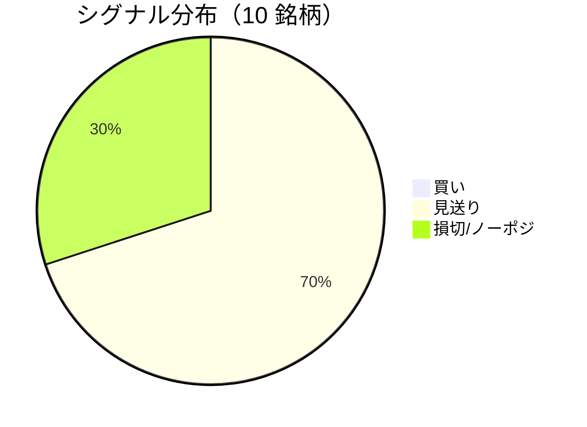

LightGBM + トリプルバリア法による自動取引エージェントの日次ログです。
本記事は GitHub 連携により stock-app から自動生成されています。

:::message alert
**運用モード: デモ** — デモ環境でのシグナル・シミュレーション結果です。投資判断の参考情報であり、売買推奨ではありません。
:::

## 本日のサマリー

- 処理成功: **10** 銘柄 / 失敗: **0** 銘柄
- 🟢 買い: **0** / ⚪ 見送り: **7** / 🔴 損切・ノーポジ: **3**

## マーケット環境（2026-09-03 時点・5日リターン）

| 指標 | 5日リターン |
| --- | ---: |
| USD/JPY | -0.21% |
| 日経平均 | -2.90% |
| S&P 500 | +0.22% |

## 銘柄別シグナル

| 銘柄 | ティッカー | シグナル | 終値(円) | 利確確率 | 勝率 | PF | 最大DD | リターン |
| --- | --- | --- | ---: | ---: | ---: | ---: | ---: | ---: |
| 第一三共 | `4568.T` | ⚪ 見送り | 2,854 | 26.1% | 41.0% | 0.62 | -41.3% | -35.10% |
| 日立製作所 | `6501.T` | ⚪ 見送り | 5,352 | 10.3% | 40.9% | 1.16 | -23.5% | +9.62% |
| 富士通 | `6702.T` | ⚪ 見送り | 3,795 | 6.3% | 50.0% | 1.48 | -13.3% | +24.94% |
| ルネサスエレクトロニクス | `6723.T` | 🔴 ノーポジション | 3,291 | 20.5% | 42.0% | 1.24 | -17.0% | +46.06% |
| ソニーグループ | `6758.T` | 🔴 ノーポジション | 3,895 | 16.9% | 45.2% | 1.62 | -20.0% | +38.65% |
| 三菱重工業 | `7011.T` | 🔴 ノーポジション | 3,795 | 35.5% | 42.9% | 1.04 | -40.8% | +18.20% |
| 本田技研工業 | `7267.T` | ⚪ 見送り | 1,718 | 2.5% | 50.0% | 1.70 | -4.9% | +3.93% |
| SUBARU | `7270.T` | ⚪ 見送り | 2,655 | 4.0% | 25.0% | 0.82 | -9.2% | -1.72% |
| イオン | `8267.T` | ⚪ 見送り | 1,390 | 0.6% | 33.3% | 0.16 | -16.4% | -13.31% |
| 三菱UFJフィナンシャル | `8306.T` | ⚪ 見送り | 3,754 | 7.7% | 80.0% | 7.89 | -7.5% | +31.82% |

## パフォーマンスランキング（バックテスト）

### 上位 3 銘柄

| 銘柄 | ティッカー | リターン | 勝率 | PF |
| --- | --- | ---: | ---: | ---: |
| 🥇 ルネサスエレクトロニクス | `6723.T` | +46.06% | 42.0% | 1.24 |
| 🥈 ソニーグループ | `6758.T` | +38.65% | 45.2% | 1.62 |
| 🥉 三菱UFJフィナンシャル | `8306.T` | +31.82% | 80.0% | 7.89 |

### 下位 3 銘柄

| 銘柄 | ティッカー | リターン | 勝率 | PF |
| --- | --- | ---: | ---: | ---: |
| 📉 第一三共 | `4568.T` | -35.10% | 41.0% | 0.62 |
| 📉 イオン | `8267.T` | -13.31% | 33.3% | 0.16 |
| 📉 SUBARU | `7270.T` | -1.72% | 25.0% | 0.82 |

## 買いシグナル詳細

🟢 本日の買いシグナルはありません。

## バックテスト平均（10 銘柄）

| 指標 | 値 |
| --- | ---: |
| 平均勝率 | 45.0% |
| 平均 PF | 1.77 |
| 平均リターン | +12.31% |
| 平均最大 DD | -19.4% |
| 平均シャープ | 0.20 |

## 実取引実績（SQLite）

まだ実取引の記録がありません。

## Live 予測の答え合わせ（直近 30 日）

:::message
バックテストとは別に、**毎日の live シグナル**を SQLite に記録し、エントリー（翌営業日始値）から **predict_horizon 日**後にトリプルバリア outcome を採点しています。
:::

| 指標 | 値 |
| --- | ---: |
| 採点済みシグナル | 138 件 |
| 全体一致率 | 61.6% |
| 買いシグナル一致率 | 50.0%（4 件） |
| 買いシグナル平均リターン（反実仮想） | +0.99% |

### シグナル別一致率

| シグナル | 件数 | 採点済 | 一致率 |
| --- | ---: | ---: | ---: |
| 🟢 買い | 4 | 4 | 50.0% |
| ⚪ 見送り | 83 | 83 | 60.2% |
| 🔴 ノーポジション | 51 | 51 | 64.7% |

### 直近の採点結果

- ✅ **2026-09-03** 三菱重工業: 予測=🔴 ノーポジション → 実際=損切 (StopLoss, -2.58%)
- ❌ **2026-09-03** 三菱UFJフィナンシャル: 予測=⚪ 見送り → 実際=損切 (StopLoss, -2.19%)
- ❌ **2026-09-01** 富士通: 予測=⚪ 見送り → 実際=損切 (StopLoss, -2.56%)
- ✅ **2026-09-01** ソニーグループ: 予測=🔴 ノーポジション → 実際=損切 (StopLoss, -2.04%)
- ✅ **2026-09-01** 三菱重工業: 予測=🔴 ノーポジション → 実際=損切 (StopLoss, -2.58%)

## モデル概要

- **手法**: LightGBM ウォークフォワード + トリプルバリア法（3値分類）
- **特徴量**: テクニカル（SMA/RSI/MACD/ボリンジャー等）+ マクロ（USD/JPY, 日経, S&P500）
- **データリーク**: 全特徴量にラグ処理済み（未来情報なし）
- **買い判定**: 利確クラス確率 > 損切クラス確率 かつ 閾値超え

---

*このシリーズの過去ログをまとめた有料版は Zenn Books で公開予定です。*
