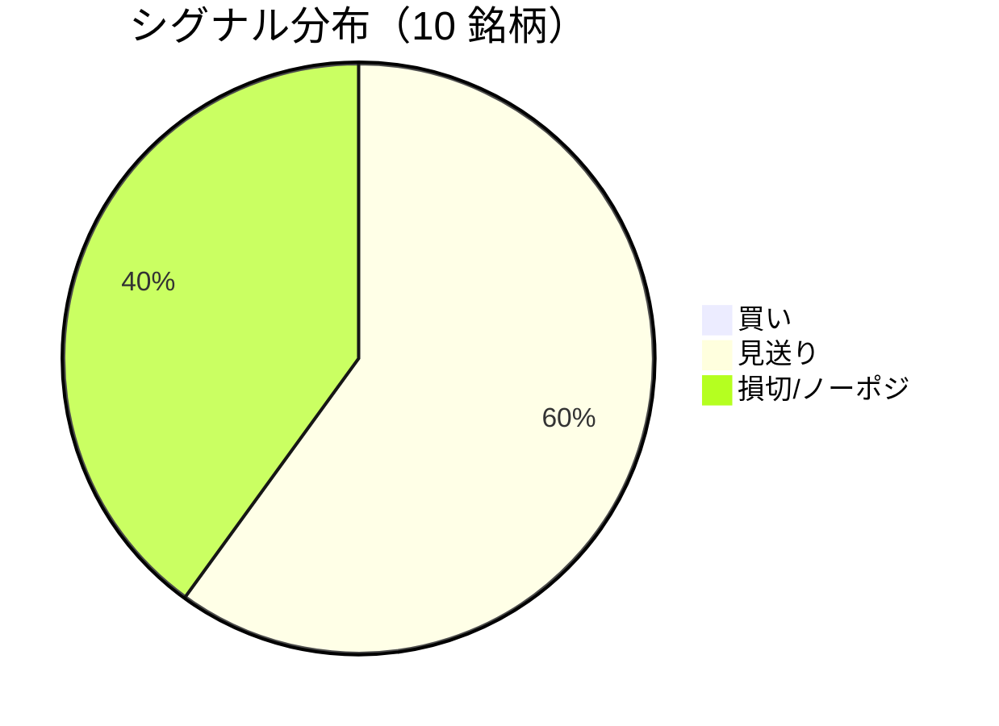

LightGBM + トリプルバリア法による自動取引エージェントの日次ログです。
本記事は GitHub 連携により stock-app から自動生成されています。

:::message alert
**運用モード: デモ** — デモ環境でのシグナル・シミュレーション結果です。投資判断の参考情報であり、売買推奨ではありません。
:::

## 本日のサマリー

- 処理成功: **10** 銘柄 / 失敗: **0** 銘柄
- 🟢 買い: **0** / ⚪ 見送り: **6** / 🔴 損切・ノーポジ: **4**

## マーケット環境（2026-09-04 時点・5日リターン）

| 指標 | 5日リターン |
| --- | ---: |
| USD/JPY | -2.30% |
| 日経平均 | -2.09% |
| S&P 500 | +0.09% |

## 銘柄別シグナル

| 銘柄 | ティッカー | シグナル | 終値(円) | 利確確率 | 勝率 | PF | 最大DD | リターン |
| --- | --- | --- | ---: | ---: | ---: | ---: | ---: | ---: |
| 第一三共 | `4568.T` | ⚪ 見送り | 2,794 | 26.6% | 43.2% | 0.71 | -46.6% | -29.69% |
| 日立製作所 | `6501.T` | ⚪ 見送り | 5,377 | 9.8% | 50.0% | 1.81 | -17.4% | +39.36% |
| 富士通 | `6702.T` | 🔴 ノーポジション | 3,900 | 5.7% | 36.7% | 0.89 | -24.3% | -4.23% |
| ルネサスエレクトロニクス | `6723.T` | 🔴 ノーポジション | 3,302 | 26.0% | 46.7% | 1.49 | -24.3% | +98.92% |
| ソニーグループ | `6758.T` | 🔴 ノーポジション | 3,885 | 16.9% | 29.4% | 0.83 | -19.4% | -7.56% |
| 三菱重工業 | `7011.T` | 🔴 ノーポジション | 3,754 | 35.3% | 43.0% | 1.04 | -49.4% | +19.91% |
| 本田技研工業 | `7267.T` | ⚪ 見送り | 1,696 | 3.3% | 33.3% | 0.87 | -9.6% | -1.20% |
| SUBARU | `7270.T` | ⚪ 見送り | 2,638 | 1.3% | 12.5% | 0.31 | -25.6% | -16.62% |
| イオン | `8267.T` | ⚪ 見送り | 1,409 | 0.6% | 25.0% | 0.22 | -14.8% | -9.54% |
| 三菱UFJフィナンシャル | `8306.T` | ⚪ 見送り | 3,785 | 7.8% | 50.0% | 2.16 | -8.9% | +12.51% |

## パフォーマンスランキング（バックテスト）

### 上位 3 銘柄

| 銘柄 | ティッカー | リターン | 勝率 | PF |
| --- | --- | ---: | ---: | ---: |
| 🥇 ルネサスエレクトロニクス | `6723.T` | +98.92% | 46.7% | 1.49 |
| 🥈 日立製作所 | `6501.T` | +39.36% | 50.0% | 1.81 |
| 🥉 三菱重工業 | `7011.T` | +19.91% | 43.0% | 1.04 |

### 下位 3 銘柄

| 銘柄 | ティッカー | リターン | 勝率 | PF |
| --- | --- | ---: | ---: | ---: |
| 📉 第一三共 | `4568.T` | -29.69% | 43.2% | 0.71 |
| 📉 SUBARU | `7270.T` | -16.62% | 12.5% | 0.31 |
| 📉 イオン | `8267.T` | -9.54% | 25.0% | 0.22 |

## 買いシグナル詳細

🟢 本日の買いシグナルはありません。

## バックテスト平均（10 銘柄）

| 指標 | 値 |
| --- | ---: |
| 平均勝率 | 37.0% |
| 平均 PF | 1.03 |
| 平均リターン | +10.19% |
| 平均最大 DD | -24.0% |
| 平均シャープ | 0.05 |

## 実取引実績（SQLite）

まだ実取引の記録がありません。

## Live 予測の答え合わせ（直近 30 日）

:::message
バックテストとは別に、**毎日の live シグナル**を SQLite に記録し、エントリー（翌営業日始値）から **predict_horizon 日**後にトリプルバリア outcome を採点しています。
:::

| 指標 | 値 |
| --- | ---: |
| 採点済みシグナル | 123 件 |
| 全体一致率 | 61.8% |
| 買いシグナル一致率 | 100.0%（1 件） |
| 買いシグナル平均リターン（反実仮想） | +4.56% |

### シグナル別一致率

| シグナル | 件数 | 採点済 | 一致率 |
| --- | ---: | ---: | ---: |
| 🟢 買い | 1 | 1 | 100.0% |
| ⚪ 見送り | 73 | 73 | 58.9% |
| 🔴 ノーポジション | 49 | 49 | 65.3% |

### 直近の採点結果

- ❌ **2026-09-03** ルネサスエレクトロニクス: 予測=🔴 ノーポジション → 実際=利確 (TakeProfit, +6.61%)
- ✅ **2026-09-03** ソニーグループ: 予測=🔴 ノーポジション → 実際=損切 (StopLoss, -2.04%)
- ✅ **2026-09-03** 三菱重工業: 予測=🔴 ノーポジション → 実際=損切 (StopLoss, -2.58%)
- ❌ **2026-09-03** 三菱UFJフィナンシャル: 予測=⚪ 見送り → 実際=損切 (StopLoss, -2.19%)
- ❌ **2026-09-02** 第一三共: 予測=⚪ 見送り → 実際=損切 (StopLoss, -4.61%)

## モデル概要

- **手法**: LightGBM ウォークフォワード + トリプルバリア法（3値分類）
- **特徴量**: テクニカル（SMA/RSI/MACD/ボリンジャー等）+ マクロ（USD/JPY, 日経, S&P500）
- **データリーク**: 全特徴量にラグ処理済み（未来情報なし）
- **買い判定**: 利確クラス確率 > 損切クラス確率 かつ 閾値超え

---

*このシリーズの過去ログをまとめた有料版は Zenn Books で公開予定です。*
