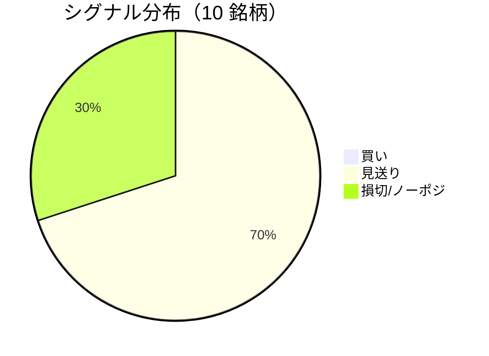

LightGBM + トリプルバリア法による自動取引エージェントの日次ログです。
本記事は GitHub 連携により stock-app から自動生成されています。

:::message alert
**運用モード: デモ** — デモ環境でのシグナル・シミュレーション結果です。投資判断の参考情報であり、売買推奨ではありません。
:::

## 本日のサマリー

- 処理成功: **10** 銘柄 / 失敗: **0** 銘柄
- 🟢 買い: **0** / ⚪ 見送り: **7** / 🔴 損切・ノーポジ: **3**

## マーケット環境（2026-09-07 時点・5日リターン）

| 指標 | 5日リターン |
| --- | ---: |
| USD/JPY | -2.45% |
| 日経平均 | +0.13% |
| S&P 500 | +0.42% |

## 銘柄別シグナル

| 銘柄 | ティッカー | シグナル | 終値(円) | 利確確率 | 勝率 | PF | 最大DD | リターン |
| --- | --- | --- | ---: | ---: | ---: | ---: | ---: | ---: |
| 第一三共 | `4568.T` | ⚪ 見送り | 2,736 | 27.6% | 40.0% | 0.62 | -52.0% | -41.17% |
| 日立製作所 | `6501.T` | ⚪ 見送り | 5,358 | 10.8% | 50.0% | 1.83 | -19.3% | +41.63% |
| 富士通 | `6702.T` | ⚪ 見送り | 3,831 | 4.6% | 41.9% | 1.11 | -14.2% | +6.79% |
| ルネサスエレクトロニクス | `6723.T` | 🔴 ノーポジション | 3,403 | 23.3% | 49.3% | 1.57 | -10.6% | +102.38% |
| ソニーグループ | `6758.T` | 🔴 ノーポジション | 3,780 | 16.9% | 41.4% | 1.32 | -13.7% | +15.68% |
| 三菱重工業 | `7011.T` | 🔴 ノーポジション | 3,829 | 30.4% | 40.9% | 0.97 | -43.3% | +1.23% |
| 本田技研工業 | `7267.T` | ⚪ 見送り | 1,695 | 2.5% | 50.0% | 2.79 | -6.3% | +11.54% |
| SUBARU | `7270.T` | ⚪ 見送り | 2,640 | 3.8% | 28.6% | 0.99 | -16.3% | +0.16% |
| イオン | `8267.T` | ⚪ 見送り | 1,389 | 0.6% | 20.0% | 0.10 | -12.2% | -10.47% |
| 三菱UFJフィナンシャル | `8306.T` | ⚪ 見送り | 3,711 | 8.2% | 62.5% | 2.80 | -4.1% | +12.39% |

## パフォーマンスランキング（バックテスト）

### 上位 3 銘柄

| 銘柄 | ティッカー | リターン | 勝率 | PF |
| --- | --- | ---: | ---: | ---: |
| 🥇 ルネサスエレクトロニクス | `6723.T` | +102.38% | 49.3% | 1.57 |
| 🥈 日立製作所 | `6501.T` | +41.63% | 50.0% | 1.83 |
| 🥉 ソニーグループ | `6758.T` | +15.68% | 41.4% | 1.32 |

### 下位 3 銘柄

| 銘柄 | ティッカー | リターン | 勝率 | PF |
| --- | --- | ---: | ---: | ---: |
| 📉 第一三共 | `4568.T` | -41.17% | 40.0% | 0.62 |
| 📉 イオン | `8267.T` | -10.47% | 20.0% | 0.10 |
| 📉 SUBARU | `7270.T` | +0.16% | 28.6% | 0.99 |

## 買いシグナル詳細

🟢 本日の買いシグナルはありません。

## バックテスト平均（10 銘柄）

| 指標 | 値 |
| --- | ---: |
| 平均勝率 | 42.5% |
| 平均 PF | 1.41 |
| 平均リターン | +14.02% |
| 平均最大 DD | -19.2% |
| 平均シャープ | 0.19 |

## 実取引実績（SQLite）

まだ実取引の記録がありません。

## Live 予測の答え合わせ（直近 30 日）

:::message
バックテストとは別に、**毎日の live シグナル**を SQLite に記録し、エントリー（翌営業日始値）から **predict_horizon 日**後にトリプルバリア outcome を採点しています。
:::

| 指標 | 値 |
| --- | ---: |
| 採点済みシグナル | 149 件 |
| 全体一致率 | 57.0% |
| 買いシグナル一致率 | 100.0%（1 件） |
| 買いシグナル平均リターン（反実仮想） | +4.56% |

### シグナル別一致率

| シグナル | 件数 | 採点済 | 一致率 |
| --- | ---: | ---: | ---: |
| 🟢 買い | 1 | 1 | 100.0% |
| ⚪ 見送り | 95 | 95 | 50.5% |
| 🔴 ノーポジション | 53 | 53 | 67.9% |

### 直近の採点結果

- ✅ **2026-09-07** ルネサスエレクトロニクス: 予測=🔴 ノーポジション → 実際=損切 (StopLoss, -3.10%)
- ✅ **2026-09-07** ソニーグループ: 予測=🔴 ノーポジション → 実際=損切 (StopLoss, -2.04%)
- ❌ **2026-09-04** 日立製作所: 予測=⚪ 見送り → 実際=損切 (StopLoss, -3.66%)
- ❌ **2026-09-04** 富士通: 予測=⚪ 見送り → 実際=損切 (StopLoss, -2.56%)
- ✅ **2026-09-04** ルネサスエレクトロニクス: 予測=🔴 ノーポジション → 実際=損切 (StopLoss, -3.10%)

## モデル概要

- **手法**: LightGBM ウォークフォワード + トリプルバリア法（3値分類）
- **特徴量**: テクニカル（SMA/RSI/MACD/ボリンジャー等）+ マクロ（USD/JPY, 日経, S&P500）
- **データリーク**: 全特徴量にラグ処理済み（未来情報なし）
- **買い判定**: 利確クラス確率 > 損切クラス確率 かつ 閾値超え

---

*このシリーズの過去ログをまとめた有料版は Zenn Books で公開予定です。*
