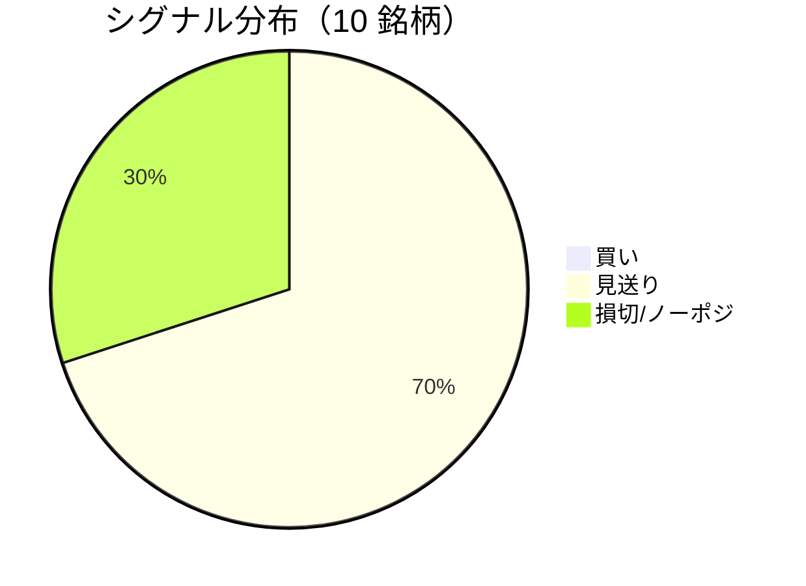

LightGBM + トリプルバリア法による自動取引エージェントの日次ログです。
本記事は GitHub 連携により stock-app から自動生成されています。

:::message alert
**運用モード: デモ** — デモ環境でのシグナル・シミュレーション結果です。投資判断の参考情報であり、売買推奨ではありません。
:::

## 本日のサマリー

- 処理成功: **10** 銘柄 / 失敗: **0** 銘柄
- 🟢 買い: **0** / ⚪ 見送り: **7** / 🔴 損切・ノーポジ: **3**

## マーケット環境（2026-09-11 時点・5日リターン）

| 指標 | 5日リターン |
| --- | ---: |
| USD/JPY | -0.76% |
| 日経平均 | -1.55% |
| S&P 500 | -0.80% |

## 銘柄別シグナル

| 銘柄 | ティッカー | シグナル | 終値(円) | 利確確率 | 勝率 | PF | 最大DD | リターン |
| --- | --- | --- | ---: | ---: | ---: | ---: | ---: | ---: |
| 第一三共 | `4568.T` | ⚪ 見送り | 2,772 | 27.5% | 47.8% | 0.91 | -38.0% | -7.37% |
| 日立製作所 | `6501.T` | ⚪ 見送り | 5,199 | 10.1% | 52.4% | 2.40 | -18.7% | +58.70% |
| 富士通 | `6702.T` | ⚪ 見送り | 3,749 | 7.3% | 47.8% | 1.59 | -7.2% | +20.05% |
| ルネサスエレクトロニクス | `6723.T` | 🔴 ノーポジション | 3,192 | 22.1% | 44.6% | 1.31 | -30.5% | +81.42% |
| ソニーグループ | `6758.T` | 🔴 ノーポジション | 3,632 | 16.7% | 39.3% | 1.13 | -11.0% | +6.90% |
| 三菱重工業 | `7011.T` | 🔴 ノーポジション | 3,705 | 35.5% | 39.7% | 0.92 | -47.5% | -13.47% |
| 本田技研工業 | `7267.T` | ⚪ 見送り | 1,664 | 3.2% | 50.0% | 1.70 | -4.9% | +7.06% |
| SUBARU | `7270.T` | ⚪ 見送り | 2,620 | 4.5% | 50.0% | 2.24 | -16.3% | +23.28% |
| イオン | `8267.T` | ⚪ 見送り | 1,332 | 0.8% | 20.0% | 0.33 | -12.2% | -7.97% |
| 三菱UFJフィナンシャル | `8306.T` | ⚪ 見送り | 3,661 | 7.5% | 50.0% | 1.98 | -4.1% | +10.66% |

## パフォーマンスランキング（バックテスト）

### 上位 3 銘柄

| 銘柄 | ティッカー | リターン | 勝率 | PF |
| --- | --- | ---: | ---: | ---: |
| 🥇 ルネサスエレクトロニクス | `6723.T` | +81.42% | 44.6% | 1.31 |
| 🥈 日立製作所 | `6501.T` | +58.70% | 52.4% | 2.40 |
| 🥉 SUBARU | `7270.T` | +23.28% | 50.0% | 2.24 |

### 下位 3 銘柄

| 銘柄 | ティッカー | リターン | 勝率 | PF |
| --- | --- | ---: | ---: | ---: |
| 📉 三菱重工業 | `7011.T` | -13.47% | 39.7% | 0.92 |
| 📉 イオン | `8267.T` | -7.97% | 20.0% | 0.33 |
| 📉 第一三共 | `4568.T` | -7.37% | 47.8% | 0.91 |

## 買いシグナル詳細

🟢 本日の買いシグナルはありません。

## バックテスト平均（10 銘柄）

| 指標 | 値 |
| --- | ---: |
| 平均勝率 | 44.2% |
| 平均 PF | 1.45 |
| 平均リターン | +17.93% |
| 平均最大 DD | -19.1% |
| 平均シャープ | 0.28 |

## 実取引実績（SQLite）

まだ実取引の記録がありません。

## Live 予測の答え合わせ（直近 30 日）

:::message
バックテストとは別に、**毎日の live シグナル**を SQLite に記録し、エントリー（翌営業日始値）から **predict_horizon 日**後にトリプルバリア outcome を採点しています。
:::

| 指標 | 値 |
| --- | ---: |
| 採点済みシグナル | 160 件 |
| 全体一致率 | 58.1% |
| 買いシグナル一致率 | —（0 件） |
| 買いシグナル平均リターン（反実仮想） | — |

### シグナル別一致率

| シグナル | 件数 | 採点済 | 一致率 |
| --- | ---: | ---: | ---: |
| 🟢 買い | 0 | 0 | — |
| ⚪ 見送り | 107 | 107 | 50.5% |
| 🔴 ノーポジション | 53 | 53 | 73.6% |

### 直近の採点結果

- ❌ **2026-09-08** 富士通: 予測=⚪ 見送り → 実際=利確 (TakeProfit, +5.67%)
- ✅ **2026-09-08** ルネサスエレクトロニクス: 予測=🔴 ノーポジション → 実際=損切 (StopLoss, -3.10%)
- ✅ **2026-09-08** 三菱重工業: 予測=🔴 ノーポジション → 実際=損切 (StopLoss, -2.58%)
- ❌ **2026-09-08** イオン: 予測=⚪ 見送り → 実際=損切 (StopLoss, -4.31%)
- ❌ **2026-09-07** 日立製作所: 予測=⚪ 見送り → 実際=損切 (StopLoss, -3.66%)

## モデル概要

- **手法**: LightGBM ウォークフォワード + トリプルバリア法（3値分類）
- **特徴量**: テクニカル（SMA/RSI/MACD/ボリンジャー等）+ マクロ（USD/JPY, 日経, S&P500）
- **データリーク**: 全特徴量にラグ処理済み（未来情報なし）
- **買い判定**: 利確クラス確率 > 損切クラス確率 かつ 閾値超え

---

*このシリーズの過去ログをまとめた有料版は Zenn Books で公開予定です。*
