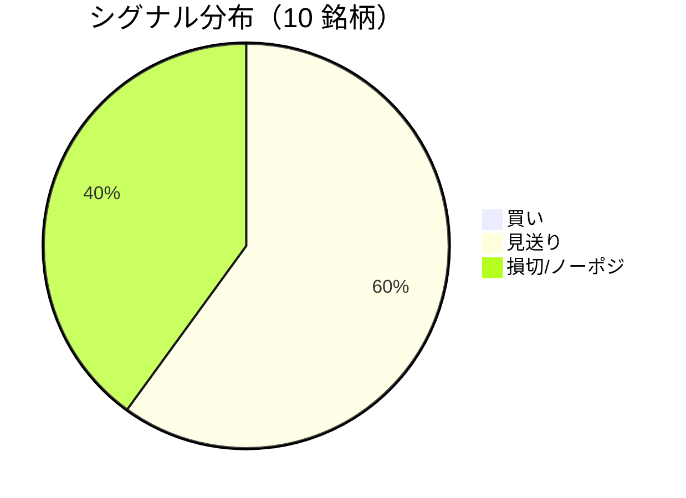

LightGBM + トリプルバリア法による自動取引エージェントの日次ログです。
本記事は GitHub 連携により stock-app から自動生成されています。

:::message alert
**運用モード: デモ** — デモ環境でのシグナル・シミュレーション結果です。投資判断の参考情報であり、売買推奨ではありません。
:::

## 本日のサマリー

- 処理成功: **10** 銘柄 / 失敗: **0** 銘柄
- 🟢 買い: **0** / ⚪ 見送り: **6** / 🔴 損切・ノーポジ: **4**

## マーケット環境（2026-09-29 時点・5日リターン）

| 指標 | 5日リターン |
| --- | ---: |
| USD/JPY | -0.01% |
| 日経平均 | +0.71% |
| S&P 500 | -1.21% |

## 銘柄別シグナル

| 銘柄 | ティッカー | シグナル | 終値(円) | 利確確率 | 勝率 | PF | 最大DD | リターン |
| --- | --- | --- | ---: | ---: | ---: | ---: | ---: | ---: |
| 第一三共 | `4568.T` | ⚪ 見送り | 2,784 | 28.2% | 46.7% | 0.90 | -35.8% | -11.23% |
| 日立製作所 | `6501.T` | ⚪ 見送り | 5,465 | 10.0% | 60.9% | 2.52 | -20.0% | +76.03% |
| 富士通 | `6702.T` | 🔴 ノーポジション | 3,945 | 4.6% | 45.5% | 1.13 | -11.8% | +3.12% |
| ルネサスエレクトロニクス | `6723.T` | 🔴 ノーポジション | 3,458 | 30.0% | 44.0% | 1.31 | -28.7% | +73.55% |
| ソニーグループ | `6758.T` | 🔴 ノーポジション | 3,732 | 18.2% | 35.0% | 1.21 | -14.4% | +6.42% |
| 三菱重工業 | `7011.T` | 🔴 ノーポジション | 3,793 | 44.2% | 42.0% | 1.01 | -36.9% | +7.25% |
| 本田技研工業 | `7267.T` | ⚪ 見送り | 1,669 | 2.6% | 20.0% | 1.05 | -8.5% | +0.70% |
| SUBARU | `7270.T` | ⚪ 見送り | 2,534 | 6.3% | 44.4% | 1.23 | -22.2% | +4.70% |
| イオン | `8267.T` | ⚪ 見送り | 1,264 | 1.4% | 71.4% | 19.38 | -2.7% | +27.17% |
| 三菱UFJフィナンシャル | `8306.T` | ⚪ 見送り | 3,592 | 6.7% | 50.0% | 2.54 | -9.8% | +17.73% |

## パフォーマンスランキング（バックテスト）

### 上位 3 銘柄

| 銘柄 | ティッカー | リターン | 勝率 | PF |
| --- | --- | ---: | ---: | ---: |
| 🥇 日立製作所 | `6501.T` | +76.03% | 60.9% | 2.52 |
| 🥈 ルネサスエレクトロニクス | `6723.T` | +73.55% | 44.0% | 1.31 |
| 🥉 イオン | `8267.T` | +27.17% | 71.4% | 19.38 |

### 下位 3 銘柄

| 銘柄 | ティッカー | リターン | 勝率 | PF |
| --- | --- | ---: | ---: | ---: |
| 📉 第一三共 | `4568.T` | -11.23% | 46.7% | 0.90 |
| 📉 本田技研工業 | `7267.T` | +0.70% | 20.0% | 1.05 |
| 📉 富士通 | `6702.T` | +3.12% | 45.5% | 1.13 |

## 買いシグナル詳細

🟢 本日の買いシグナルはありません。

## バックテスト平均（10 銘柄）

| 指標 | 値 |
| --- | ---: |
| 平均勝率 | 46.0% |
| 平均 PF | 3.23 |
| 平均リターン | +20.55% |
| 平均最大 DD | -19.1% |
| 平均シャープ | 0.37 |

## 実取引実績（SQLite）

まだ実取引の記録がありません。

## Live 予測の答え合わせ（直近 30 日）

:::message
バックテストとは別に、**毎日の live シグナル**を SQLite に記録し、エントリー（翌営業日始値）から **predict_horizon 日**後にトリプルバリア outcome を採点しています。
:::

| 指標 | 値 |
| --- | ---: |
| 採点済みシグナル | 78 件 |
| 全体一致率 | 43.6% |
| 買いシグナル一致率 | —（0 件） |
| 買いシグナル平均リターン（反実仮想） | — |

### シグナル別一致率

| シグナル | 件数 | 採点済 | 一致率 |
| --- | ---: | ---: | ---: |
| 🟢 買い | 0 | 0 | — |
| ⚪ 見送り | 53 | 53 | 26.4% |
| 🔴 ノーポジション | 25 | 25 | 80.0% |

### 直近の採点結果

- ✅ **2026-09-14** 日立製作所: 予測=⚪ 見送り → 実際=タイムアウト (Timeout, +4.01%)
- ❌ **2026-09-14** 富士通: 予測=⚪ 見送り → 実際=損切 (StopLoss, -2.56%)
- ❌ **2026-09-14** ルネサスエレクトロニクス: 予測=🔴 ノーポジション → 実際=利確 (TakeProfit, +6.61%)
- ✅ **2026-09-14** ソニーグループ: 予測=🔴 ノーポジション → 実際=損切 (StopLoss, -2.04%)
- ✅ **2026-09-14** 三菱重工業: 予測=🔴 ノーポジション → 実際=損切 (StopLoss, -2.58%)

## モデル概要

- **手法**: LightGBM ウォークフォワード + トリプルバリア法（3値分類）
- **特徴量**: テクニカル（SMA/RSI/MACD/ボリンジャー等）+ マクロ（USD/JPY, 日経, S&P500）
- **データリーク**: 全特徴量にラグ処理済み（未来情報なし）
- **買い判定**: 利確クラス確率 > 損切クラス確率 かつ 閾値超え

---

*このシリーズの過去ログをまとめた有料版は Zenn Books で公開予定です。*
