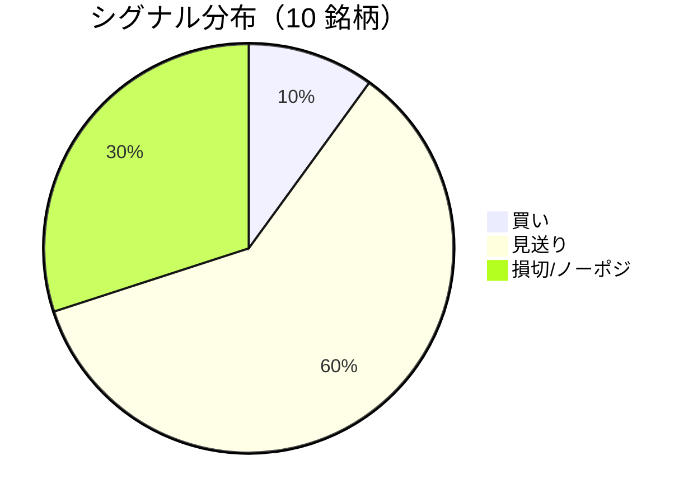

LightGBM + トリプルバリア法による自動取引エージェントの日次ログです。
本記事は GitHub 連携により stock-app から自動生成されています。

:::message alert
**運用モード: デモ** — デモ環境でのシグナル・シミュレーション結果です。投資判断の参考情報であり、売買推奨ではありません。
:::

## 本日のサマリー

- 処理成功: **10** 銘柄 / 失敗: **0** 銘柄
- 🟢 買い: **1** / ⚪ 見送り: **6** / 🔴 損切・ノーポジ: **3**

## マーケット環境（2026-09-30 時点・5日リターン）

| 指標 | 5日リターン |
| --- | ---: |
| USD/JPY | -0.04% |
| 日経平均 | +2.67% |
| S&P 500 | -0.71% |

## 銘柄別シグナル

| 銘柄 | ティッカー | シグナル | 終値(円) | 利確確率 | 勝率 | PF | 最大DD | リターン |
| --- | --- | --- | ---: | ---: | ---: | ---: | ---: | ---: |
| 第一三共 | `4568.T` | ⚪ 見送り | 2,800 | 28.2% | 52.5% | 0.99 | -28.5% | +1.07% |
| 日立製作所 | `6501.T` | ⚪ 見送り | 5,489 | 9.5% | 52.4% | 2.10 | -20.0% | +47.38% |
| 富士通 | `6702.T` | 🔴 ノーポジション | 3,957 | 3.9% | 46.2% | 1.15 | -11.4% | +3.88% |
| ルネサスエレクトロニクス | `6723.T` | 🔴 ノーポジション | 3,477 | 19.1% | 43.6% | 1.26 | -27.9% | +54.73% |
| ソニーグループ | `6758.T` | 🔴 ノーポジション | 3,759 | 18.0% | 38.9% | 1.80 | -10.5% | +15.50% |
| 三菱重工業 | `7011.T` | 🟢 買い | 3,839 | 47.2% | 42.9% | 1.03 | -39.7% | +17.72% |
| 本田技研工業 | `7267.T` | ⚪ 見送り | 1,682 | 2.6% | 20.0% | 1.05 | -8.5% | +0.70% |
| SUBARU | `7270.T` | ⚪ 見送り | 2,550 | 8.8% | 44.4% | 1.44 | -15.8% | +7.52% |
| イオン | `8267.T` | ⚪ 見送り | 1,289 | 3.4% | 50.0% | 0.95 | -22.6% | -0.89% |
| 三菱UFJフィナンシャル | `8306.T` | ⚪ 見送り | 3,700 | 6.7% | 40.0% | 1.35 | -8.5% | +2.81% |

## パフォーマンスランキング（バックテスト）

### 上位 3 銘柄

| 銘柄 | ティッカー | リターン | 勝率 | PF |
| --- | --- | ---: | ---: | ---: |
| 🥇 ルネサスエレクトロニクス | `6723.T` | +54.73% | 43.6% | 1.26 |
| 🥈 日立製作所 | `6501.T` | +47.38% | 52.4% | 2.10 |
| 🥉 三菱重工業 | `7011.T` | +17.72% | 42.9% | 1.03 |

### 下位 3 銘柄

| 銘柄 | ティッカー | リターン | 勝率 | PF |
| --- | --- | ---: | ---: | ---: |
| 📉 イオン | `8267.T` | -0.89% | 50.0% | 0.95 |
| 📉 本田技研工業 | `7267.T` | +0.70% | 20.0% | 1.05 |
| 📉 第一三共 | `4568.T` | +1.07% | 52.5% | 0.99 |

## 買いシグナル詳細

:::details 三菱重工業（`7011.T`）— 買いシグナル
**予測日**: 2026-09-30

| 項目 | 値 |
| --- | --- |
| 終値 | 3,839 円 |
| 🟢 利確確率 | 47.18% |
| 🔴 損切確率 | 44.97% |
| ⚪ タイムアウト確率 | 7.85% |

**指値提案**（予算 300,000 円 / pt=4.56% / sl=-2.58% / horizon=9日）

| 種別 | 価格 | 株数 |
| --- | ---: | ---: |
| 指値（買い） | 4,014 円 | 0 株 |
| 逆指値（損切） | 3,740 円 | — |

**直近シミュレーション取引（最大3件）**

- 2026-09-03 00:00:00 → 2026-09-11 00:00:00: 3,745 → 3,647 円 (損切) | 損益 -34,339 円
- 2026-09-14 00:00:00 → 2026-09-17 00:00:00: 3,678 → 3,843 円 (利確) | 損益 +49,357 円
- 2026-09-18 00:00:00 → 2026-09-30 00:00:00: 3,875 → 3,773 円 (損切) | 損益 -34,805 円
:::

## バックテスト平均（10 銘柄）

| 指標 | 値 |
| --- | ---: |
| 平均勝率 | 43.1% |
| 平均 PF | 1.31 |
| 平均リターン | +15.04% |
| 平均最大 DD | -19.3% |
| 平均シャープ | 0.26 |

## 実取引実績（SQLite）

まだ実取引の記録がありません。

## Live 予測の答え合わせ（直近 30 日）

:::message
バックテストとは別に、**毎日の live シグナル**を SQLite に記録し、エントリー（翌営業日始値）から **predict_horizon 日**後にトリプルバリア outcome を採点しています。
:::

| 指標 | 値 |
| --- | ---: |
| 採点済みシグナル | 68 件 |
| 全体一致率 | 42.6% |
| 買いシグナル一致率 | —（0 件） |
| 買いシグナル平均リターン（反実仮想） | — |

### シグナル別一致率

| シグナル | 件数 | 採点済 | 一致率 |
| --- | ---: | ---: | ---: |
| 🟢 買い | 0 | 0 | — |
| ⚪ 見送り | 46 | 46 | 26.1% |
| 🔴 ノーポジション | 22 | 22 | 77.3% |

### 直近の採点結果

- ✅ **2026-09-14** 日立製作所: 予測=⚪ 見送り → 実際=タイムアウト (Timeout, +4.01%)
- ❌ **2026-09-14** 富士通: 予測=⚪ 見送り → 実際=損切 (StopLoss, -2.56%)
- ❌ **2026-09-14** ルネサスエレクトロニクス: 予測=🔴 ノーポジション → 実際=利確 (TakeProfit, +6.61%)
- ✅ **2026-09-14** ソニーグループ: 予測=🔴 ノーポジション → 実際=損切 (StopLoss, -2.04%)
- ✅ **2026-09-14** 三菱重工業: 予測=🔴 ノーポジション → 実際=損切 (StopLoss, -2.58%)

## モデル概要

- **手法**: LightGBM ウォークフォワード + トリプルバリア法（3値分類）
- **特徴量**: テクニカル（SMA/RSI/MACD/ボリンジャー等）+ マクロ（USD/JPY, 日経, S&P500）
- **データリーク**: 全特徴量にラグ処理済み（未来情報なし）
- **買い判定**: 利確クラス確率 > 損切クラス確率 かつ 閾値超え

---

*このシリーズの過去ログをまとめた有料版は Zenn Books で公開予定です。*
