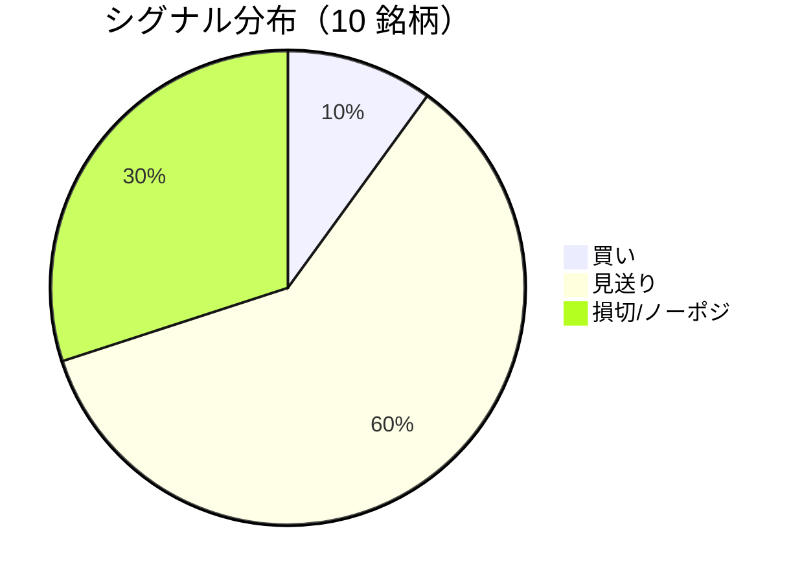

LightGBM + トリプルバリア法による自動取引エージェントの日次ログです。
本記事は GitHub 連携により stock-app から自動生成されています。

:::message alert
**運用モード: デモ** — デモ環境でのシグナル・シミュレーション結果です。投資判断の参考情報であり、売買推奨ではありません。
:::

## 本日のサマリー

- 処理成功: **10** 銘柄 / 失敗: **0** 銘柄
- 🟢 買い: **1** / ⚪ 見送り: **6** / 🔴 損切・ノーポジ: **3**

## マーケット環境（2026-10-01 時点・5日リターン）

| 指標 | 5日リターン |
| --- | ---: |
| USD/JPY | -0.45% |
| 日経平均 | +5.25% |
| S&P 500 | -0.49% |

## 銘柄別シグナル

| 銘柄 | ティッカー | シグナル | 終値(円) | 利確確率 | 勝率 | PF | 最大DD | リターン |
| --- | --- | --- | ---: | ---: | ---: | ---: | ---: | ---: |
| 第一三共 | `4568.T` | ⚪ 見送り | 2,740 | 31.2% | 51.2% | 0.98 | -25.5% | +0.08% |
| 日立製作所 | `6501.T` | ⚪ 見送り | 5,510 | 10.4% | 57.1% | 2.20 | -20.0% | +51.36% |
| 富士通 | `6702.T` | 🔴 ノーポジション | 4,002 | 3.9% | 50.0% | 1.47 | -10.8% | +11.50% |
| ルネサスエレクトロニクス | `6723.T` | 🔴 ノーポジション | 3,616 | 30.3% | 43.0% | 1.24 | -27.9% | +49.56% |
| ソニーグループ | `6758.T` | 🔴 ノーポジション | 3,787 | 18.0% | 38.1% | 1.23 | -13.9% | +6.94% |
| 三菱重工業 | `7011.T` | 🟢 買い | 3,842 | 53.7% | 43.1% | 1.04 | -34.5% | +20.93% |
| 本田技研工業 | `7267.T` | ⚪ 見送り | 1,696 | 2.6% | 42.9% | 2.85 | -5.2% | +17.13% |
| SUBARU | `7270.T` | ⚪ 見送り | 2,537 | 8.2% | 57.1% | 3.61 | -9.6% | +23.75% |
| イオン | `8267.T` | ⚪ 見送り | 1,250 | 2.8% | 50.0% | 0.95 | -22.6% | -0.89% |
| 三菱UFJフィナンシャル | `8306.T` | ⚪ 見送り | 3,586 | 7.2% | 40.0% | 1.18 | -9.9% | +1.60% |

## パフォーマンスランキング（バックテスト）

### 上位 3 銘柄

| 銘柄 | ティッカー | リターン | 勝率 | PF |
| --- | --- | ---: | ---: | ---: |
| 🥇 日立製作所 | `6501.T` | +51.36% | 57.1% | 2.20 |
| 🥈 ルネサスエレクトロニクス | `6723.T` | +49.56% | 43.0% | 1.24 |
| 🥉 SUBARU | `7270.T` | +23.75% | 57.1% | 3.61 |

### 下位 3 銘柄

| 銘柄 | ティッカー | リターン | 勝率 | PF |
| --- | --- | ---: | ---: | ---: |
| 📉 イオン | `8267.T` | -0.89% | 50.0% | 0.95 |
| 📉 第一三共 | `4568.T` | +0.08% | 51.2% | 0.98 |
| 📉 三菱UFJフィナンシャル | `8306.T` | +1.60% | 40.0% | 1.18 |

## 買いシグナル詳細

:::details 三菱重工業（`7011.T`）— 買いシグナル
**予測日**: 2026-10-01

| 項目 | 値 |
| --- | --- |
| 終値 | 3,842 円 |
| 🟢 利確確率 | 53.71% |
| 🔴 損切確率 | 39.78% |
| ⚪ タイムアウト確率 | 6.51% |

**指値提案**（予算 300,000 円 / pt=4.56% / sl=-2.58% / horizon=9日）

| 種別 | 価格 | 株数 |
| --- | ---: | ---: |
| 指値（買い） | 4,017 円 | 0 株 |
| 逆指値（損切） | 3,743 円 | — |

**直近シミュレーション取引（最大3件）**

- 2026-09-03 00:00:00 → 2026-09-11 00:00:00: 3,745 → 3,647 円 (損切) | 損益 -35,276 円
- 2026-09-14 00:00:00 → 2026-09-17 00:00:00: 3,678 → 3,843 円 (利確) | 損益 +50,704 円
- 2026-09-18 00:00:00 → 2026-09-30 00:00:00: 3,875 → 3,773 円 (損切) | 損益 -35,754 円
:::

## バックテスト平均（10 銘柄）

| 指標 | 値 |
| --- | ---: |
| 平均勝率 | 47.3% |
| 平均 PF | 1.67 |
| 平均リターン | +18.20% |
| 平均最大 DD | -18.0% |
| 平均シャープ | 0.34 |

## 実取引実績（SQLite）

まだ実取引の記録がありません。

## Live 予測の答え合わせ（直近 30 日）

:::message
バックテストとは別に、**毎日の live シグナル**を SQLite に記録し、エントリー（翌営業日始値）から **predict_horizon 日**後にトリプルバリア outcome を採点しています。
:::

| 指標 | 値 |
| --- | ---: |
| 採点済みシグナル | 62 件 |
| 全体一致率 | 45.2% |
| 買いシグナル一致率 | —（0 件） |
| 買いシグナル平均リターン（反実仮想） | — |

### シグナル別一致率

| シグナル | 件数 | 採点済 | 一致率 |
| --- | ---: | ---: | ---: |
| 🟢 買い | 0 | 0 | — |
| ⚪ 見送り | 42 | 42 | 28.6% |
| 🔴 ノーポジション | 20 | 20 | 80.0% |

### 直近の採点結果

- ✅ **2026-10-01** ルネサスエレクトロニクス: 予測=🔴 ノーポジション → 実際=損切 (StopLoss, -3.10%)
- ❌ **2026-09-30** 三菱UFJフィナンシャル: 予測=⚪ 見送り → 実際=損切 (StopLoss, -2.19%)
- ✅ **2026-09-14** 第一三共: 予測=⚪ 見送り → 実際=タイムアウト (Timeout, -3.75%)
- ✅ **2026-09-14** 日立製作所: 予測=⚪ 見送り → 実際=タイムアウト (Timeout, +4.01%)
- ❌ **2026-09-14** 富士通: 予測=⚪ 見送り → 実際=損切 (StopLoss, -2.56%)

## モデル概要

- **手法**: LightGBM ウォークフォワード + トリプルバリア法（3値分類）
- **特徴量**: テクニカル（SMA/RSI/MACD/ボリンジャー等）+ マクロ（USD/JPY, 日経, S&P500）
- **データリーク**: 全特徴量にラグ処理済み（未来情報なし）
- **買い判定**: 利確クラス確率 > 損切クラス確率 かつ 閾値超え

---

*このシリーズの過去ログをまとめた有料版は Zenn Books で公開予定です。*
